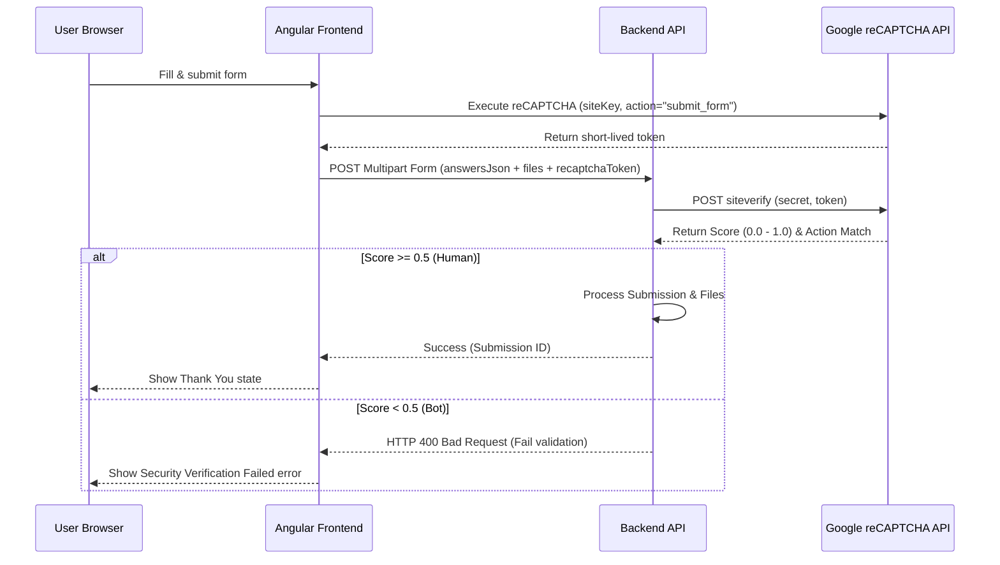

# reCAPTCHA v3 Backend Integration Guide

This document outlines the technical requirements and implementation steps for verifying Google reCAPTCHA v3 tokens submitted from the frontend application.

---

## 1. Architectural Overview

reCAPTCHA v3 uses a score-based verification system that doesn't interrupt the user's journey. 
1. **Frontend**: Generates a short-lived token by executing reCAPTCHA v3 with an action (`submit_form`) when a user submits a form.
2. **Transmission**: The token is sent alongside the form fields to the backend under the `recaptchaToken` field of the multipart form request.
3. **Backend**: Intercepts the request, calls Google's API to verify the token, receives a score (0.0 to 1.0), and decides whether to accept or block the submission.



---

## 2. Request Details

When a form is submitted, the frontend sends a `POST` request to the forms API endpoint:
* **Content-Type**: `multipart/form-data`
* **Payload Fields**:
  * `answersJson`: A JSON-serialized string of form field values (answers).
  * `recaptchaToken`: The string token generated by Google (e.g., `03AFcWeA4...`).
  * `files` *(Optional)*: File attachments uploaded as part of the form.

---

## 3. Backend Verification Step

Your backend endpoint must verify the token **before** saving answers or processing files.

### Verification Endpoint
* **Method**: `POST`
* **URL**: `https://www.google.com/recaptcha/api/siteverify`
* **Content-Type**: `application/x-www-form-urlencoded`

### Request Parameters
| Name | Type | Description |
|---|---|---|
| `secret` | String | **[Required]** The shared secret key between your site and reCAPTCHA. **Do not expose this key.** |
| `response` | String | **[Required]** The user response token (provided by the `recaptchaToken` field in the request). |
| `remoteip` | String | *[Optional]* The user's IP address. |

### Google's Response Payload
Google returns a JSON object. Ensure you parse and validate these fields:
```json
{
  "success": true|false,
  "challenge_ts": "2026-05-24T20:30:00Z",
  "hostname": "askamuslim.com",
  "score": 0.9,
  "action": "submit_form",
  "error-codes": [...] // Optional, present if success is false
}
```

### Validation Checklist
1. **Verify success**: `success === true`.
2. **Verify action**: `action === "submit_form"` (guards against token replay attacks from other contexts).
3. **Verify score**: We recommend a default score threshold of `0.5`. A score below `0.5` should block the request as a potential bot submission.

---

## 4. Credentials

> [!WARNING]
> Keep the secret key strictly confidential. Avoid checking it into version control. Use environment variables.

* **reCAPTCHA Site Key** (Frontend): `6Ldo5fosAAAAADcGCgqD2Oo4BIwMXodOxrcbwS2R`
* **reCAPTCHA Secret Key** (Backend): `6Ldo5fosAAAAAKb1nczrrr6okRQ2w1WDQoWWGmTr`

---

## 5. Implementation Code Examples

Here are standard verification code snippets for common backend stacks.

### Node.js / Express
```javascript
const axios = require('axios');

async function verifyRecaptcha(token, userIp) {
  const secretKey = process.env.RECAPTCHA_SECRET_KEY || '6Ldo5fosAAAAAKb1nczrrr6okRQ2w1WDQoWWGmTr';
  const url = 'https://www.google.com/recaptcha/api/siteverify';
  
  const params = new URLSearchParams({
    secret: secretKey,
    response: token
  });
  if (userIp) params.append('remoteip', userIp);

  try {
    const res = await axios.post(url, params.toString(), {
      headers: { 'Content-Type': 'application/x-www-form-urlencoded' }
    });

    const { success, score, action } = res.data;
    
    // Validate score and action name to block replay attacks
    if (success && action === 'submit_form' && score >= 0.5) {
      return { verified: true, score };
    }
    
    return { verified: false, score: score || 0 };
  } catch (error) {
    console.error('reCAPTCHA siteverify request failed:', error.message);
    return { verified: false, error: 'verification_failed' };
  }
}
```

### Python / FastAPI
```python
import os
import httpx
from fastapi import HTTPException, status

RECAPTCHA_SECRET_KEY = os.getenv("RECAPTCHA_SECRET_KEY", "6Ldo5fosAAAAAKb1nczrrr6okRQ2w1WDQoWWGmTr")

async def verify_recaptcha(token: str, remote_ip: str = None) -> bool:
    url = "https://www.google.com/recaptcha/api/siteverify"
    payload = {
        "secret": RECAPTCHA_SECRET_KEY,
        "response": token
    }
    if remote_ip:
        payload["remoteip"] = remote_ip

    async with httpx.AsyncClient() as client:
        response = await client.post(url, data=payload)
        if response.status_code != 200:
            return False
            
        data = response.json()
        success = data.get("success", False)
        action = data.get("action", "")
        score = data.get("score", 0.0)
        
        # Threshold standard = 0.5
        if success and action == "submit_form" and score >= 0.5:
            return True
            
        return False
```

### C# / .NET Core
```csharp
using System.Net.Http;
using System.Text.Json;
using System.Threading.Tasks;
using System.Collections.Generic;

public class RecaptchaService
{
    private readonly HttpClient _httpClient;
    private const string SecretKey = "6Ldo5fosAAAAAKb1nczrrr6okRQ2w1WDQoWWGmTr";

    public RecaptchaService(HttpClient httpClient)
    {
        _httpClient = httpClient;
    }

    public async Task<bool> VerifyTokenAsync(string token, string remoteIp = null)
    {
        var url = "https://www.google.com/recaptcha/api/siteverify";
        var payload = new Dictionary<string, string>
        {
            { "secret", SecretKey },
            { "response", token }
        };

        if (!string.IsNullOrEmpty(remoteIp))
        {
            payload.Add("remoteip", remoteIp);
        }

        var content = new FormUrlEncodedContent(payload);
        var response = await _httpClient.PostAsync(url, content);
        
        if (!response.IsSuccessStatusCode) return false;

        var jsonString = await response.Content.ReadAsStringAsync();
        using var jsonDoc = JsonDocument.Parse(jsonString);
        var root = jsonDoc.RootElement;

        bool success = root.GetProperty("success").GetBoolean();
        string action = root.TryGetProperty("action", out var actionProp) ? actionProp.GetString() : "";
        double score = root.TryGetProperty("score", out var scoreProp) ? scoreProp.GetDouble() : 0.0;

        return success && action == "submit_form" && score >= 0.5;
    }
}
```

### PHP
```php
<?php

function verifyRecaptcha($token, $remoteIp = null) {
    $secretKey = getenv('RECAPTCHA_SECRET_KEY') ?: '6Ldo5fosAAAAAKb1nczrrr6okRQ2w1WDQoWWGmTr';
    $url = 'https://www.google.com/recaptcha/api/siteverify';
    
    $data = [
        'secret' => $secretKey,
        'response' => $token
    ];
    if ($remoteIp) {
        $data['remoteip'] = $remoteIp;
    }
    
    $options = [
        'http' => [
            'header'  => "Content-Type: application/x-www-form-urlencoded\r\n",
            'method'  => 'POST',
            'content' => http_build_query($data)
        ]
    ];
    
    $context  = stream_context_create($options);
    $result = file_get_contents($url, false, $context);
    if ($result === FALSE) {
        return false;
    }
    
    $response = json_decode($result, true);
    
    return (
        $response['success'] === true &&
        $response['action'] === 'submit_form' &&
        $response['score'] >= 0.5
    );
}
```

---

## 6. Best Practices for Backend Execution

1. **Threshold Configuration**: Keep the score threshold configurable (e.g. via backend environment config/database) instead of hardcoding `0.5`, enabling fast tuning in case bots start getting high scores or real users trigger low scores.
2. **Error Logging**: Log failures, verification errors, and instances with low scores (under `0.3`) for threat intelligence monitoring.
3. **Graceful Failures**: If the call to Google's API times out or fails (HTTP status !== 200), we recommend failing gracefully (permitting submission but logging a warning) so that outages on Google's side do not prevent real users from sending forms.
