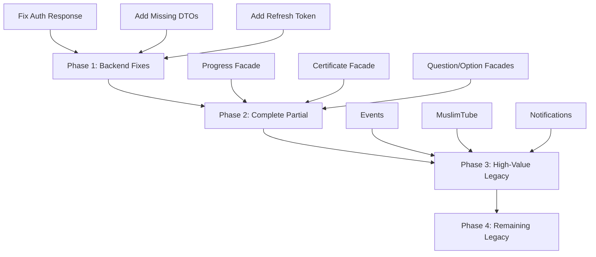

# API Integration Recommendations

**Project:** AskAMuslim  
**Last Updated:** February 13, 2026  
**Purpose:** Prioritized roadmap for completing API integrations  

---

## Executive Summary

The AskAMuslim frontend has successfully implemented the core API integration infrastructure with 8 facades complete. However, critical backend issues and missing Swagger definitions are blocking full migration. This document outlines the recommended sequence for completing the integration.

---

## Current State Analysis

### What's Working (8 Core Facades Complete)

| Facade | Endpoints | Status |
|--------|-----------|--------|
| IdentityFacade | 9 | ✅ Complete |
| CourseFacade | 8 | ✅ Complete |
| EnrollmentFacade | 6 | ✅ Complete |
| InstructorFacade | 3 | ✅ Complete |
| LessonFacade | 6 | ✅ Complete |
| QuizFacade | 5 | ✅ Complete |
| StudentFacade | 3 | ✅ Complete |
| AnswerFacade | 6 | ✅ Complete |

### What's Blocked (Backend Issues)

| Issue | Severity | Impact |
|-------|----------|--------|
| Login returns `void` instead of `AuthResponse` | CRITICAL | Cannot authenticate users |
| Missing DTOs in Swagger | HIGH | Type safety broken |
| No refresh token endpoint | CRITICAL | Users must re-login frequently |
| 25+ endpoints missing response schemas | HIGH | Integration failures |

### What's Pending (Not in Swagger Yet)

18 legacy services still use the old `ApiService` + `API_ENDPOINTS` pattern because their endpoints are not exposed in Swagger.

---

## Recommended Priority Order

### Phase 1: Fix Critical Backend Issues (BLOCKING)

**Priority: P0 - Must complete before any other work**

#### 1.1 Fix Authentication Response Schema

**Problem:** The login endpoint returns `void` instead of a proper `AuthResponse` object.

**Impact:** Frontend cannot receive JWT tokens, making authentication impossible.

**Action Required (Backend Team):**
```csharp
// Backend: Add proper response type
[HttpPost("login")]
[ProducesResponseType(typeof(AuthResponse), StatusCodes.Status200OK)]
[ProducesResponseType(typeof(ProblemDetails), StatusCodes.Status400BadRequest)]
public async Task<ActionResult<AuthResponse>> Login([FromBody] LoginViewModel model)
{
    // ... authentication logic
    return Ok(new AuthResponse 
    {
        AccessToken = token,
        RefreshToken = refreshToken,
        TokenType = "Bearer",
        ExpiresIn = 3600
    });
}
```

**Action Required (Frontend Team):**
1. Wait for backend update
2. Run `npm run generate:api` to regenerate client
3. Update `IdentityFacade` to use new response type
4. Test login flow end-to-end

#### 1.2 Add Missing DTOs to Swagger

**Problem:** 11 critical DTOs are missing from the Swagger specification.

**Missing DTOs:**
- `AuthResponse` (CRITICAL)
- `StudentReadDTO` (HIGH)
- `InstructorReadDTO` (HIGH)
- `EnrollmentReadDTO` (HIGH)
- `QuestionReadDTO` (HIGH)
- `OptionReadDTO` (HIGH)
- `CertificateReadDTO` (MEDIUM)
- `UserReadDTO` (MEDIUM)
- `QuizEvaluationResultDTO` (MEDIUM)
- `PrayerTimesDTO` (LOW)
- `QiblaDirectionDTO` (LOW)

**Action Required (Backend Team):**
```csharp
// Add XML documentation and ProducesResponseType to all endpoints
[HttpGet("{id}")]
[ProducesResponseType(typeof(StudentReadDTO), StatusCodes.Status200OK)]
public async Task<ActionResult<StudentReadDTO>> GetStudent(string id)
```

#### 1.3 Implement Refresh Token Endpoint

**Problem:** No refresh token endpoint exists, forcing users to re-login when tokens expire.

**Action Required (Backend Team):**
```csharp
[HttpPost("refresh-token")]
[ProducesResponseType(typeof(AuthResponse), StatusCodes.Status200OK)]
public async Task<ActionResult<AuthResponse>> RefreshToken([FromBody] RefreshTokenRequest request)
```

**Action Required (Frontend Team):**
1. Update `TokenService` to handle refresh tokens
2. Update `AuthInterceptor` to use refresh endpoint on 401
3. Test token refresh flow

---

### Phase 2: Complete Partial Migrations (HIGH PRIORITY)

**Priority: P1 - After Phase 1 is complete**

#### 2.1 Progress Facade Enhancement

**Current State:** Partial - some endpoints exist in Swagger

**What's Missing:**
- Proper `ProgressReadDTO` typing
- Error handling for edge cases

**Actions:**
1. Verify all progress endpoints are in Swagger
2. Create/update `ProgressFacade` with full CRUD operations
3. Add signals for reactive state management
4. Integrate with course completion logic

#### 2.2 Certificate Facade Enhancement

**Current State:** Partial - only some endpoints in Swagger

**What's Missing:**
- `CertificateReadDTO` not defined
- Auto-generate endpoint response type

**Actions:**
1. Wait for backend to add `CertificateReadDTO`
2. Create `CertificateFacade`
3. Integrate with progress completion flow
4. Add certificate download functionality

#### 2.3 Question & Option Facades

**Current State:** Partial - endpoints exist but missing response types

**What's Missing:**
- `QuestionReadDTO` not defined
- `OptionReadDTO` not defined

**Actions:**
1. Wait for backend to add DTOs
2. Create `QuestionFacade` with bulk operations
3. Create `OptionFacade` for answer options
4. Integrate with quiz creation flow

---

### Phase 3: Migrate High-Value Legacy Services (MEDIUM PRIORITY)

**Priority: P2 - After Phase 2 is complete**

These services provide significant user value and should be migrated once backend exposes them in Swagger.

#### 3.1 Events Service (HIGH VALUE)

**Current State:** Legacy - uses `ApiService`

**Why Priority:** Events are a key feature for community engagement

**Actions:**
1. Request backend team to add Events endpoints to Swagger
2. Create `EventFacade` once available
3. Migrate `events.service.ts` to use facade
4. Update components to use new facade

#### 3.2 MuslimTube Service (HIGH VALUE)

**Current State:** Legacy - uses `ApiService`

**Why Priority:** Video content is a core feature

**Actions:**
1. Request backend team to add MuslimTube endpoints to Swagger
2. Create `MuslimTubeFacade` once available
3. Migrate `muslim-tube.service.ts` to use facade
4. Update video components

#### 3.3 Notifications Service (MEDIUM VALUE)

**Current State:** Legacy - uses `ApiService`

**Why Priority:** User engagement and retention

**Actions:**
1. Request backend team to add Notifications endpoints to Swagger
2. Create `NotificationFacade` once available
3. Implement real-time notification handling
4. Update notification components

---

### Phase 4: Migrate Remaining Legacy Services (LOW PRIORITY)

**Priority: P3 - After Phase 3 is complete**

These services are lower priority but should eventually be migrated for consistency.

| Service | Priority | Notes |
|---------|----------|-------|
| Tags | Low | Used for categorization |
| Levels | Low | Used for course filtering |
| Preachers | Medium | Used for scholar profiles |
| QAs | Medium | Q&A feature |
| InquiryRequests | Low | Contact form submissions |
| MeetingRequests | Low | Meeting scheduling |
| StudentNotes | Low | Note-taking feature |
| StudentQuestions | Medium | Student Q&A |
| QuizAttempts | Medium | Quiz history |
| Admins | Low | Admin management |
| AdminNotes | Low | Admin notes |

---

## Implementation Checklist

### Before Starting Any Migration

- [ ] Verify backend endpoint is in Swagger
- [ ] Verify response schema is defined
- [ ] Run `npm run generate:api` to get latest client
- [ ] Check generated types in `src/app/api/models/`

### For Each Facade Creation

- [ ] Create facade file in `src/app/core/api/facades/`
- [ ] Import generated functions from `generated/fn/`
- [ ] Implement signals for state management
- [ ] Add error handling with `ErrorNormalizer`
- [ ] Export from `index.ts`
- [ ] Write unit tests
- [ ] Update components to use facade
- [ ] Remove legacy service dependencies

### After Migration Complete

- [ ] Remove deprecated `API_ENDPOINTS` entries
- [ ] Update documentation
- [ ] Run full test suite
- [ ] Verify no console errors
- [ ] Check network tab for correct API calls

---

## Dependency Graph



---

## Risk Assessment

### High Risk Items

| Risk | Mitigation |
|------|------------|
| Backend team unavailable | Document all requirements clearly, provide code examples |
| Breaking changes to API | Use contract tests, version APIs |
| Token refresh fails | Implement fallback to re-login |
| Missing DTOs cause runtime errors | Use strict TypeScript, add runtime validation |

### Medium Risk Items

| Risk | Mitigation |
|------|------------|
| Performance degradation | Add pagination, implement caching |
| Error handling gaps | Comprehensive error normalizer |
| State management complexity | Use signals consistently |

---

## Success Metrics

### Phase 1 Success Criteria

- [ ] Login returns proper `AuthResponse`
- [ ] All critical DTOs defined in Swagger
- [ ] Token refresh works automatically
- [ ] No authentication-related console errors

### Phase 2 Success Criteria

- [ ] All partial facades complete
- [ ] Full type safety on all endpoints
- [ ] Error handling works consistently

### Phase 3 Success Criteria

- [ ] Events, MuslimTube, Notifications migrated
- [ ] Legacy service count reduced by 50%
- [ ] All components use facades

### Final Success Criteria

- [ ] Zero legacy services remaining
- [ ] Zero manual endpoint strings
- [ ] 100% type safety on API calls
- [ ] Contract tests pass in CI

---

## Communication Plan

### For Backend Team

1. **Immediate:** Share critical issues list (Phase 1)
2. **Weekly:** Progress update on frontend migration
3. **As Needed:** Request new endpoints be added to Swagger

### For Frontend Team

1. **Daily:** Standup on migration progress
2. **Weekly:** Demo completed facades
3. **Per Phase:** Code review and testing

---

## Next Immediate Actions

### This Week

1. **Contact backend team** about critical authentication issues
2. **Document** exact DTO requirements with code examples
3. **Prepare** facade templates for quick implementation

### Next Week

1. **Regenerate** API client once backend updates Swagger
2. **Implement** authentication fixes
3. **Test** login flow end-to-end

### This Month

1. **Complete** Phase 1 (backend fixes)
2. **Start** Phase 2 (partial migrations)
3. **Plan** Phase 3 timeline with backend team

---

*This document should be updated as phases are completed and new requirements emerge.*
