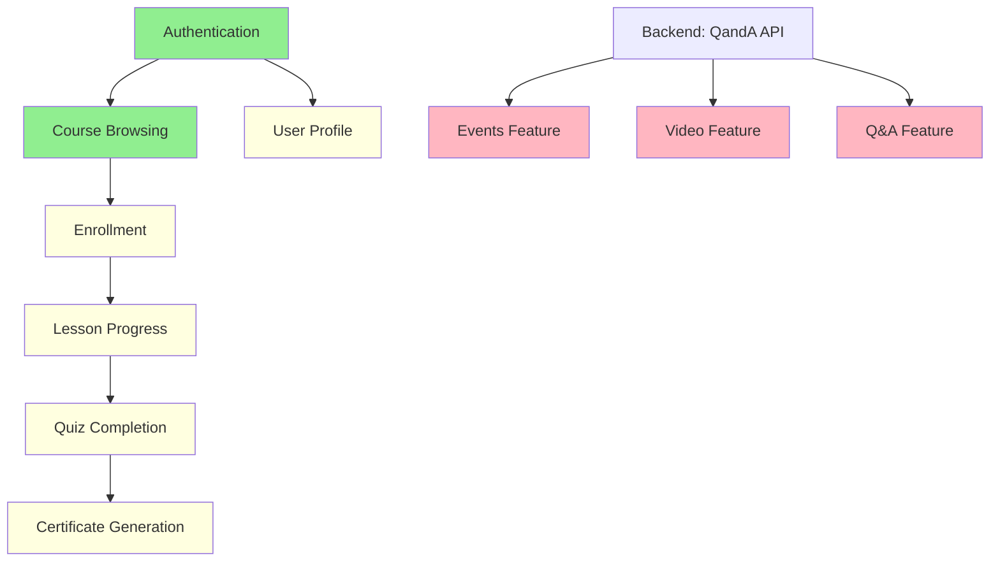

# AskAMuslim - Full API Integration Roadmap

**Project:** AskAMuslim  
**Last Updated:** February 13, 2026  
**Status:** Authentication Working - Ready for Feature Integration  

---

## Executive Summary

### Current State
- **Authentication:** WORKING - JWT Bearer token authentication functional
- **API Endpoints:** 73 endpoints available across 15 controllers
- **Facades Complete:** 8 core facades (Identity, Course, Enrollment, Instructor, Lesson, Quiz, Student, Answer)
- **Infrastructure:** Complete (TokenService, Interceptors, ErrorNormalizer)

### Target State
- All frontend components connected to backend APIs
- Full type safety with generated TypeScript types
- Comprehensive error handling and loading states
- Production-ready application

---

## Phase 1: Immediate API Integration

### Priority Order by User Flow Criticality

#### 1.1 Authentication Flow (CRITICAL) - PARTIALLY COMPLETE

| Component | Location | Status | Action Needed |
|-----------|----------|--------|---------------|
| LoginComponent | `src/app/core/auth/login/` | NEEDS UPDATE | Connect to IdentityFacade |
| RegisterComponent | `src/app/core/auth/register/` | NEEDS UPDATE | Connect to IdentityFacade |
| ResetPasswordComponent | `src/app/core/auth/reset-password/` | NEEDS UPDATE | Connect to IdentityFacade |
| TokenService | `src/app/core/auth/token.service.ts` | COMPLETE | - |
| AuthInterceptor | `src/app/core/http/interceptors/` | COMPLETE | - |

**Integration Steps:**
1. Update LoginComponent to use `IdentityFacade.login()`
2. Add loading state with signal: `loading = this.identityFacade.loading`
3. Add error handling: `error = this.identityFacade.error`
4. Navigate to home on successful login
5. Same pattern for RegisterComponent

**State Management:**
```typescript
// In LoginComponent
readonly loading = this.identityFacade.loading;
readonly error = this.identityFacade.error;
readonly isAuthenticated = this.identityFacade.isAuthenticated;

onSubmit(): void {
  this.identityFacade.login(this.credentials).subscribe({
    next: () => this.router.navigate(['/home']),
    error: (err) => { /* error already in signal */ }
  });
}
```

---

#### 1.2 Academy/Course Browsing (HIGH) - PARTIALLY COMPLETE

| Component | Location | Status | Action Needed |
|-----------|----------|--------|---------------|
| AcademyComponent | `src/app/pages/academy/` | NEEDS UPDATE | Connect to CourseFacade |
| CourseComponent | `src/app/pages/academy/course/` | NEEDS UPDATE | Connect to CourseFacade |
| LessonOverviewComponent | `src/app/pages/academy/lesson-overview/` | NEEDS UPDATE | Connect to LessonFacade |
| LessonPlayerComponent | `src/app/pages/academy/lesson-player/` | NEEDS UPDATE | Connect to LessonFacade |
| QuizComponent | `src/app/pages/academy/quiz/` | NEEDS UPDATE | Connect to QuizFacade |

**API Endpoints to Integrate:**
- `GET /api/Course/GetCourses` - List all courses
- `GET /api/Course/GetCourseById/{id}` - Course details
- `GET /api/Lesson/GetCourseLessons/{courseId}` - Lessons for course
- `GET /api/Lesson/GetLessonByID/{id}` - Lesson details
- `GET /api/Quiz/{id}` - Quiz details

**State Management Changes:**
```typescript
// In AcademyComponent
private readonly courseFacade = inject(CourseFacade);
readonly courses = this.courseFacade.courses;
readonly loading = this.courseFacade.loading;
readonly error = this.courseFacade.error;

ngOnInit(): void {
  this.courseFacade.getCourses().subscribe();
}
```

**Error Handling:**
- Display error message in UI
- Retry button for failed requests
- Fallback to cached data if available

---

#### 1.3 User Enrollment Flow (HIGH)

| Component | Location | Status | Action Needed |
|-----------|----------|--------|---------------|
| CourseComponent | `src/app/pages/academy/course/` | NEEDS UPDATE | Add enrollment functionality |
| MyLearningComponent | `src/app/pages/account/my-learning/` | NEEDS UPDATE | Show enrolled courses |

**API Endpoints to Integrate:**
- `POST /api/Enrollment/Enroll` - Enroll in course
- `GET /api/Enrollment/GetEnrolledCoursesByStudent` - Get student courses
- `DELETE /api/Enrollment/UnEnroll` - Unenroll from course

**State Management:**
```typescript
// Enrollment state
private readonly _enrolledCourses = signal<CourseReadDto[]>([]);
readonly enrolledCourses = this._enrolledCourses.asReadonly();

enroll(courseId: string): Observable<void> {
  return this.enrollmentFacade.enroll({ studentId: this.userId, courseId });
}
```

---

#### 1.4 Quiz/Assessment Flow (MEDIUM)

| Component | Location | Status | Action Needed |
|-----------|----------|--------|---------------|
| QuizComponent | `src/app/pages/academy/quiz/` | NEEDS UPDATE | Full quiz integration |
| QuizResults | `src/app/pages/academy/quiz/` | NEEDS UPDATE | Show results from API |

**API Endpoints to Integrate:**
- `GET /api/Question/quiz/{quizId}` - Get quiz questions
- `GET /api/Option/{questionId}` - Get question options
- `POST /api/Answer` - Submit answer
- `POST /api/QuizEvaluation/evaluate/{quizId}` - Evaluate quiz

**State Management:**
```typescript
// Quiz state
private readonly _currentQuiz = signal<QuizReadDto | null>(null);
private readonly _questions = signal<QuestionReadDto[]>([]);
private readonly _answers = signal<Map<string, string>>(new Map());
private readonly _results = signal<QuizEvaluationResultDTO | null>(null);
```

---

#### 1.5 User Profile/Account (MEDIUM)

| Component | Location | Status | Action Needed |
|-----------|----------|--------|---------------|
| AccountComponent | `src/app/pages/account/` | NEEDS UPDATE | Load user data |
| AboutComponent | `src/app/pages/account/about/` | NEEDS UPDATE | Edit profile |
| EditMainInformation | `src/app/pages/account/about/edit-main-information/` | NEEDS UPDATE | Update name |
| EditContactInformation | `src/app/pages/account/about/edit-contact-information/` | NEEDS UPDATE | Update email |

**API Endpoints to Integrate:**
- `GET /api/Student/{id}` - Get student profile
- `PUT /api/Identity/UpdateName` - Update name
- `PUT /api/Identity/UpdateEmail` - Update email
- `PUT /api/Identity/UpdatePassword` - Update password

---

#### 1.6 Progress Tracking (MEDIUM)

| Component | Location | Status | Action Needed |
|-----------|----------|--------|---------------|
| LessonPlayerComponent | `src/app/pages/academy/lesson-player/` | NEEDS UPDATE | Track progress |
| MyLearningComponent | `src/app/pages/account/my-learning/` | NEEDS UPDATE | Show progress |

**API Endpoints to Integrate:**
- `POST /api/Progress/CreateProgress` - Create progress record
- `PUT /api/Progress/MarkProgressAsCompleted/{id}` - Mark complete
- `GET /api/Progress/GetProgressByStudentId/{studentId}` - Get progress

---

### Feature Areas NOT in Swagger (Blocked)

These components require backend work before integration:

| Feature | Components | Status | Blocker |
|---------|------------|--------|---------|
| Events | EventsComponent, EventDetailComponent | BLOCKED | Not in Swagger |
| MuslimTube | MuslimTubeComponent, VideoDetailComponent | BLOCKED | Not in Swagger |
| Q&A | AskQaComponent, QuestionComponent | BLOCKED | Not in Swagger |
| Meet Scholar | MeetScholarComponent | BLOCKED | Not in Swagger |
| Notifications | (Various) | BLOCKED | Not in Swagger |

---

## Phase 2: Integration Checklist by Feature Area

### 2.1 User Authentication

| Task | Status | Details |
|------|--------|---------|
| Login API connected | COMPLETE | IdentityFacade.login() |
| Register API connected | PENDING | IdentityFacade.register() |
| Password reset connected | PENDING | IdentityFacade.updatePassword() |
| Token storage | COMPLETE | TokenService |
| Auto token refresh | PENDING | Needs backend refresh endpoint |
| Logout functionality | COMPLETE | IdentityFacade.logout() |
| Auth guard | PENDING | Create auth guard for protected routes |
| Loading states | PENDING | Add to all auth forms |
| Error messages | PENDING | Display API errors in UI |
| Form validation | PENDING | Client-side + server-side |

**Testing Approach:**
1. Unit test each facade method
2. Integration test login → token storage → API call flow
3. E2E test complete authentication journey
4. Test error scenarios (wrong password, network error)

---

### 2.2 Content Management (Courses/Lessons)

| Task | Status | Details |
|------|--------|---------|
| Course listing | PENDING | CourseFacade.getCourses() |
| Course detail | PENDING | CourseFacade.getCourseById() |
| Lesson listing | PENDING | LessonFacade.getCourseLessons() |
| Lesson detail | PENDING | LessonFacade.getLessonById() |
| Course filtering | PENDING | By category, level |
| Search functionality | PENDING | Course search |
| Loading states | PENDING | Skeleton loaders |
| Error handling | PENDING | Retry mechanisms |
| Caching | PENDING | Cache course data |

**Testing Approach:**
1. Mock API responses for unit tests
2. Test pagination (when implemented)
3. Test filtering and search
4. Test error states

---

### 2.3 User Interactions (Enrollment/Progress)

| Task | Status | Details |
|------|--------|---------|
| Enroll in course | PENDING | EnrollmentFacade.enroll() |
| Unenroll from course | PENDING | EnrollmentFacade.unenroll() |
| View enrolled courses | PENDING | EnrollmentFacade.getEnrolledCourses() |
| Track lesson progress | PENDING | Progress facade |
| Mark lesson complete | PENDING | Progress facade |
| View overall progress | PENDING | Progress facade |
| Certificate generation | PENDING | Certificate facade |

**Testing Approach:**
1. Test enrollment flow end-to-end
2. Test progress tracking accuracy
3. Test certificate generation conditions
4. Test concurrent progress updates

---

### 2.4 Quiz/Assessment System

| Task | Status | Details |
|------|--------|---------|
| Load quiz questions | PENDING | QuizFacade + QuestionFacade |
| Load question options | PENDING | OptionFacade |
| Submit answers | PENDING | AnswerFacade |
| Evaluate quiz | PENDING | QuizEvaluation endpoint |
| Show results | PENDING | Results component |
| Retry quiz | PENDING | Reset and retry |

**Testing Approach:**
1. Test question loading
2. Test answer submission
3. Test evaluation logic
4. Test edge cases (timeout, network error)

---

## Phase 3: Remaining Development Tasks

### 3.1 Data Transformation Requirements

| Area | Current State | Required Transformation |
|------|---------------|------------------------|
| Course data | Backend uses `CourseReadDTO` | Map to frontend `Course` interface |
| Lesson data | Backend uses `LessonReadDTO` | Map to frontend `Lesson` interface |
| Dates | Backend returns ISO strings | Convert to Date objects |
| Enums | Backend uses strings | Map to frontend enums |
| Pagination | Not implemented | Prepare for paged responses |

**Implementation:**
```typescript
// Create mappers in each facade
private mapCourse(dto: CourseReadDto): Course {
  return {
    id: dto.id,
    title: dto.title,
    description: dto.description ?? '',
    thumbnailUrl: dto.thumbnailUrl ?? '',
    category: dto.category as CourseCategory,
    level: dto.level as CourseLevel,
    instructorId: dto.instructorID,
    instructorName: dto.instructorName ?? '',
    lessonCount: dto.numberOfLessons,
    enrolledCount: dto.numberOfStudentsEnrolled
  };
}
```

---

### 3.2 Missing API Endpoints (Backend Work Needed)

| Endpoint | Purpose | Priority |
|----------|---------|----------|
| `POST /api/Identity/refresh-token` | Token refresh | HIGH |
| `GET /api/Event/*` | Events management | HIGH |
| `GET /api/MuslimTube/*` | Video content | HIGH |
| `GET /api/Notification/*` | User notifications | MEDIUM |
| `GET /api/Tag/*` | Tag management | LOW |
| `GET /api/Level/*` | Level management | LOW |

---

### 3.3 Frontend Components Needing API Connectivity

| Component | API Needed | Status |
|-----------|------------|--------|
| HomeComponent | Courses, Events | PENDING |
| EventsComponent | Events API | BLOCKED |
| MuslimTubeComponent | MuslimTube API | BLOCKED |
| AskQaComponent | Q&A API | BLOCKED |
| MeetScholarComponent | Meeting API | BLOCKED |
| NotificationsComponent | Notifications API | BLOCKED |

---

## Phase 4: Quality Assurance

### 4.1 Integration Testing Approach

| Test Type | Tools | Coverage Target |
|-----------|-------|-----------------|
| Unit Tests | Jasmine/Jest | 80% of facades |
| Integration Tests | Jasmine + HttpClientTestingModule | All API calls |
| E2E Tests | Playwright/Cypress | Critical user flows |
| Contract Tests | JSON Schema | All API responses |

**Test Structure:**
```
src/
  app/
    core/
      api/
        facades/
          course.facade.spec.ts
          identity.facade.spec.ts
          ...
```

---

### 4.2 End-to-End User Flow Testing Scenarios

| Scenario | Steps | Expected Result |
|----------|-------|-----------------|
| User Registration | Register → Verify Email → Login | Account created, logged in |
| Course Enrollment | Browse → View Course → Enroll → Start Lesson | Enrolled, progress tracked |
| Quiz Completion | Start Quiz → Answer Questions → Submit → View Results | Score displayed |
| Profile Update | Edit Name → Save → Verify | Name updated |
| Password Reset | Request Reset → Verify Email → Set New Password | Password changed |

---

### 4.3 Edge Case and Error Scenario Coverage

| Scenario | Test Case | Expected Behavior |
|----------|-----------|-------------------|
| Network Error | Disconnect during API call | Show error, retry option |
| Invalid Token | Token expired | Auto-refresh or redirect to login |
| Server Error | 500 response | Show friendly error message |
| Validation Error | 400 response | Show field errors |
| Unauthorized | 401 response | Redirect to login |
| Rate Limited | 429 response | Show message, retry later |
| Empty Data | No courses available | Show empty state |
| Slow Network | High latency | Show loading state |

---

## Phase 5: Deployment Readiness

### 5.1 Environment Configuration

| Item | Development | Production | Status |
|------|-------------|------------|--------|
| API Base URL | `https://askamusslimapi.runasp.net` | Same or new | CONFIGURED |
| Test Credentials | Stored in env | Remove | DONE |
| JWT Secret | N/A (backend) | N/A | - |
| Environment Files | `environment.development.ts` | `environment.production.ts` | NEEDS UPDATE |

**Production Environment:**
```typescript
// environment.production.ts
export const environment = {
  production: true,
  apiBaseUrl: 'https://askamusslimapi.runasp.net',
  // Remove test credentials
};
```

---

### 5.2 Security Verification

| Item | Status | Action |
|------|--------|--------|
| HTTPS only | PENDING | Verify all API calls use HTTPS |
| Token storage | COMPLETE | Memory-first, localStorage fallback |
| XSS Prevention | PENDING | Sanitize user input |
| CSRF Protection | PENDING | Verify with backend |
| Sensitive Data | PENDING | Audit console logs |
| Auth Guard | PENDING | Implement route protection |

---

### 5.3 Performance Optimization

| Item | Status | Action |
|------|--------|--------|
| Lazy Loading | PENDING | Implement route-level lazy loading |
| API Response Caching | PENDING | Cache course data |
| Image Optimization | PENDING | Compress images |
| Bundle Size | PENDING | Analyze and reduce |
| OnPush Change Detection | PENDING | Optimize components |

---

### 5.4 Client Delivery Checklist

#### Pre-Launch
- [ ] All critical user flows working
- [ ] Error handling comprehensive
- [ ] Loading states implemented
- [ ] Empty states designed
- [ ] Responsive design verified
- [ ] Cross-browser testing complete
- [ ] Mobile testing complete
- [ ] Performance benchmarks met
- [ ] Security audit passed
- [ ] Accessibility audit passed

#### Documentation
- [ ] API integration guide complete
- [ ] Component documentation
- [ ] State management guide
- [ ] Error handling guide
- [ ] Testing guide

#### Monitoring
- [ ] Error tracking configured
- [ ] Analytics configured
- [ ] Performance monitoring
- [ ] Uptime monitoring

#### Backup & Recovery
- [ ] Database backup verified
- [ ] Disaster recovery plan
- [ ] Rollback procedure documented

---

## Dependency Graph



**Legend:**
- Green: Complete/Working
- Yellow: In Progress
- Red: Blocked (needs backend work)

---

## Timeline Summary

| Phase | Duration | Dependencies |
|-------|----------|--------------|
| Phase 1: Immediate Integration | 2-3 weeks | None |
| Phase 2: Integration Checklist | 2-3 weeks | Phase 1 |
| Phase 3: Remaining Development | 3-4 weeks | Backend API work |
| Phase 4: QA Testing | 1-2 weeks | Phases 1-3 |
| Phase 5: Deployment | 1 week | Phase 4 |

---

*This roadmap is a living document and should be updated as work progresses.*
