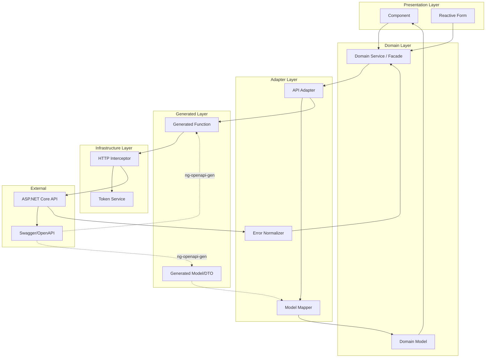
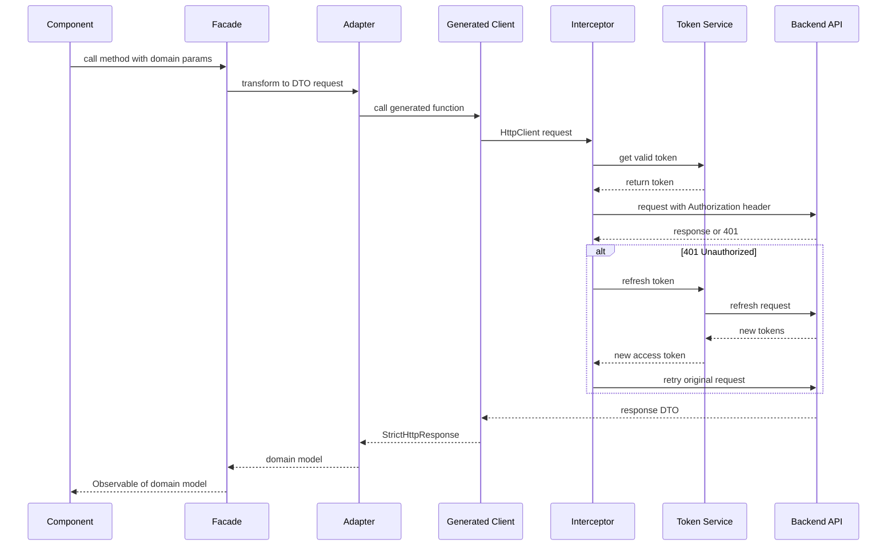
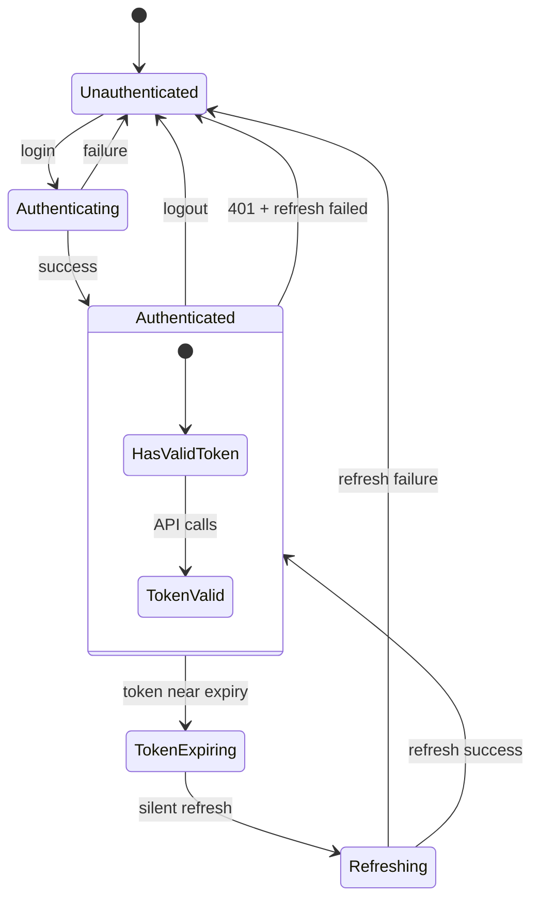
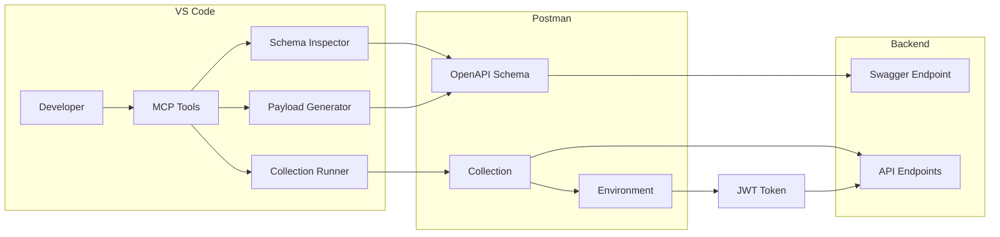
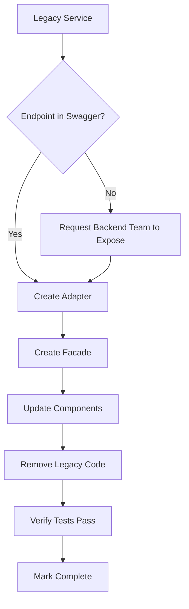
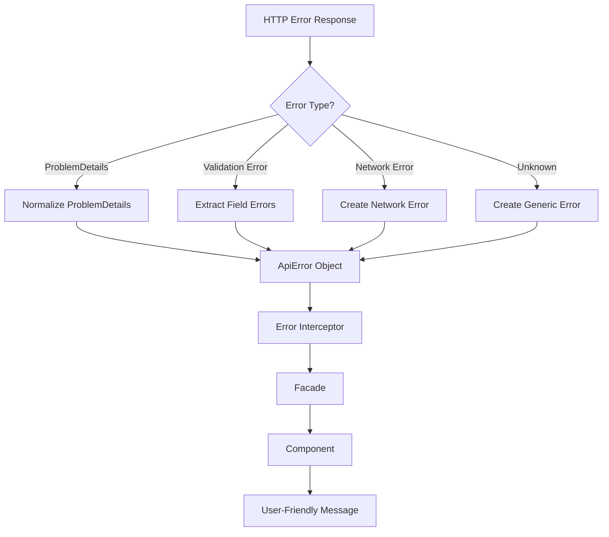

# Enterprise API Integration Architecture
## Contract-Enforced, Self-Validating, Fully Automated System

---

## Executive Summary

This document defines the architecture for a production-grade, contract-enforced, fully automated API integration system between the Angular 20 frontend and ASP.NET Core backend. The system treats Swagger/OpenAPI as the single source of truth and uses Postman MCP as the validation engine.

---

## Table of Contents

1. [Core Architectural Principles](#1-core-architectural-principles)
2. [System Architecture Overview](#2-system-architecture-overview)
3. [Folder Structure](#3-folder-structure)
4. [Layer Design](#4-layer-design)
5. [Authentication System](#5-authentication-system)
6. [HTTP Interceptor Design](#6-http-interceptor-design)
7. [Adapter Pattern Implementation](#7-adapter-pattern-implementation)
8. [Swagger Hash Lock Strategy](#8-swagger-hash-lock-strategy)
9. [CI/CD Pipeline Design](#9-cicd-pipeline-design)
10. [Postman MCP Integration](#10-postman-mcp-integration)
11. [Migration Strategy](#11-migration-strategy)
12. [Form Scaffolding System](#12-form-scaffolding-system)
13. [Error Normalization Strategy](#13-error-normalization-strategy)
14. [Risk Mitigation](#14-risk-mitigation)
15. [Implementation Roadmap](#15-implementation-roadmap)

---

## 1. Core Architectural Principles

### The Ten Commandments

| # | Principle | Enforcement |
|---|-----------|-------------|
| 1 | **Swagger is the single source of truth** | All API types come from generated code |
| 2 | **No manual API wiring** | Zero hardcoded endpoint strings in components |
| 3 | **No components calling HttpClient directly** | All calls go through facades |
| 4 | **No generated file modification** | Generated folder is read-only |
| 5 | **Contract drift must fail CI immediately** | Hash comparison on every build |
| 6 | **All authentication flows must be automated** | Token refresh is transparent |
| 7 | **Postman MCP is the validation engine** | Schema validation via MCP tools |
| 8 | **Frontend must survive backend changes safely** | Adapters normalize all DTOs |
| 9 | **Components never depend on generated DTOs directly** | Domain models only |
| 10 | **No fragile URL string checks** | HttpContextToken for auth skipping |

---

## 2. System Architecture Overview

### Data Flow Diagram



### Request Lifecycle



---

## 3. Folder Structure

```
src/app/core/
├── api/
│   ├── generated/                    # AUTO-GENERATED - DO NOT EDIT
│   │   ├── api-configuration.ts
│   │   ├── api.ts
│   │   ├── functions.ts
│   │   ├── models.ts
│   │   ├── request-builder.ts
│   │   ├── strict-http-response.ts
│   │   ├── fn/                       # Generated API functions
│   │   │   ├── identity/
│   │   │   ├── course/
│   │   │   └── ...
│   │   └── models/                   # Generated DTOs
│   │       ├── login-view-model.ts
│   │       └── ...
│   ├── adapters/                     # DTO ↔ Domain mapping
│   │   ├── identity.adapter.ts
│   │   ├── course.adapter.ts
│   │   ├── enrollment.adapter.ts
│   │   └── index.ts
│   ├── facades/                      # Domain services
│   │   ├── identity.facade.ts
│   │   ├── course.facade.ts
│   │   └── index.ts
│   └── swagger.hash                  # Contract lock file
│
├── auth/
│   ├── token.service.ts              # Token management with signals
│   ├── auth.interceptor.ts           # Enterprise HTTP interceptor
│   ├── refresh-queue.service.ts      # Prevent parallel refreshes
│   └── auth.guard.ts                 # Route protection
│
├── domain/
│   ├── models/                       # Domain models
│   │   ├── user.model.ts
│   │   ├── course.model.ts
│   │   └── index.ts
│   └── errors/
│       ├── api-error.model.ts
│       └── error-normalizer.ts
│
├── http/
│   ├── context-tokens.ts             # HttpContextToken definitions
│   └── http-context.ts               # Context helpers
│
├── interceptors/
│   ├── auth.interceptor.ts           # JWT injection + refresh
│   ├── error.interceptor.ts          # Global error handling
│   └── logging.interceptor.ts        # Request/response logging
│
├── services/                         # Legacy - TO BE MIGRATED
│   └── ...
│
└── constants/
    └── api-endpoints.ts              # Legacy - TO BE REMOVED
```

---

## 4. Layer Design

### 4.1 Generated Layer - Complete Isolation

**Location:** `src/app/core/api/generated/`

**Rules:**
- Never modify any file in this directory
- All files are regenerated on `npm run generate:api`
- This folder should be gitignored or committed as-is

**Configuration - ng-openapi-gen.json:**
```json
{
  "$schema": "node_modules/ng-openapi-gen/ng-openapi-gen-schema.json",
  "input": "https://askamusslimapi.runasp.net/swagger/v1/swagger.json",
  "output": "src/app/core/api/generated",
  "ignoreUnusedModels": false,
  "modelIndex": true,
  "serviceIndex": true,
  "enumWithValues": true,
  "dateFormat": "string",
  "prefix": "Api",
  "suffix": "Dto",
  "generateStrictHttpResponse": true
}
```

### 4.2 Adapter Layer - DTO Normalization

**Purpose:** Transform generated DTOs to domain models and vice versa

**Responsibilities:**
- Normalize DTOs to domain models
- Map nullable fields safely
- Map backend enums to frontend-safe values
- Normalize error responses
- Validate response shapes

**Adapter Interface:**
```typescript
// src/app/core/api/adapters/base.adapter.ts
export interface ApiAdapter<TDto, TDomain> {
  toDomain(dto: TDto): TDomain;
  toDto(domain: Partial<TDomain>): Partial<TDto>;
  toDomainArray(dtos: TDto[]): TDomain[];
}

export interface ErrorNormalizer {
  normalize(error: unknown): ApiError;
}
```

### 4.3 Facade Layer - Domain Services

**Purpose:** Provide clean API to components, handle business logic

**Responsibilities:**
- Expose domain-friendly methods
- Handle loading states with signals
- Cache responses when appropriate
- Coordinate multiple adapters
- Emit domain models only

---

## 5. Authentication System

### 5.1 Token Service with Signals

```typescript
// src/app/core/auth/token.service.ts
@Injectable({ providedIn: 'root' })
export class TokenService {
  // Memory-first storage using signals
  private readonly _accessToken = signal<string | null>(null);
  private readonly _refreshToken = signal<string | null>(null);
  private readonly _tokenExpiry = signal<number | null>(null);
  
  // Computed signals
  readonly accessToken = this._accessToken.asReadonly();
  readonly isAuthenticated = computed(() => !!this._accessToken());
  readonly isTokenExpiringSoon = computed(() => {
    const expiry = this._tokenExpiry();
    if (!expiry) return false;
    return Date.now() > expiry - 60000; // 1 minute before expiry
  });
  
  // Secure fallback to localStorage for persistence
  private readonly storageKey = 'aam_auth';
  
  setTokens(accessToken: string, refreshToken: string, expiresIn: number): void {
    this._accessToken.set(accessToken);
    this._refreshToken.set(refreshToken);
    this._tokenExpiry.set(Date.now() + expiresIn * 1000);
    this.persistToStorage({ accessToken, refreshToken, expiresIn });
  }
  
  clearTokens(): void {
    this._accessToken.set(null);
    this._refreshToken.set(null);
    this._tokenExpiry.set(null);
    this.clearStorage();
  }
  
  getValidToken(): Observable<string> {
    if (this.isTokenExpiringSoon()) {
      return this.refreshAccessToken().pipe(
        map(() => this._accessToken()!)
      );
    }
    return of(this._accessToken()!);
  }
  
  private refreshAccessToken(): Observable<void> {
    // Delegated to RefreshQueueService
  }
}
```

### 5.2 Refresh Queue Service - Prevent Parallel Refreshes

```typescript
// src/app/core/auth/refresh-queue.service.ts
@Injectable({ providedIn: 'root' })
export class RefreshQueueService {
  private refreshInProgress = false;
  private pendingRequests: Array<(token: string) => void> = [];
  
  private readonly refreshTokenSubject = new BehaviorSubject<string | null>(null);
  
  queueRefresh(): Observable<string> {
    if (this.refreshInProgress) {
      // Wait for existing refresh to complete
      return this.refreshTokenSubject.pipe(
        filter(token => token !== null),
        take(1)
      );
    }
    
    this.refreshInProgress = true;
    return this.executeRefresh().pipe(
      tap(token => {
        this.refreshInProgress = false;
        this.refreshTokenSubject.next(token);
        this.pendingRequests.forEach(resolve => resolve(token));
        this.pendingRequests = [];
      }),
      catchError(error => {
        this.refreshInProgress = false;
        this.pendingRequests = [];
        return throwError(() => error);
      })
    );
  }
  
  private executeRefresh(): Observable<string> {
    // Call refresh endpoint via generated client
  }
}
```

### 5.3 Authentication Flow Diagram



---

## 6. HTTP Interceptor Design

### 6.1 HttpContextToken Pattern - No URL Matching

```typescript
// src/app/core/http/context-tokens.ts
import { HttpContextToken } from '@angular/common/http';

// Skip authentication for specific requests
export const SKIP_AUTH = new HttpContextToken<boolean>(() => false);

// Skip error handling for specific requests
export const SKIP_ERROR_HANDLING = new HttpContextToken<boolean>(() => false);

// Custom timeout for specific requests
export const CUSTOM_TIMEOUT = new HttpContextToken<number | null>(() => null);

// Retry configuration
export const RETRY_COUNT = new HttpContextToken<number>(() => 0);
```

### 6.2 Enterprise Auth Interceptor

```typescript
// src/app/core/interceptors/auth.interceptor.ts
@Injectable({ providedIn: 'root' })
export class AuthInterceptor implements HttpInterceptor {
  private readonly tokenService = inject(TokenService);
  private readonly refreshQueue = inject(RefreshQueueService);
  private readonly router = inject(Router);
  
  intercept(req: HttpRequest<unknown>, next: HttpHandler): Observable<HttpEvent<unknown>> {
    // Check if auth should be skipped using HttpContextToken
    if (req.context.get(SKIP_AUTH)) {
      return next.handle(req);
    }
    
    return this.tokenService.getValidToken().pipe(
      take(1),
      switchMap(token => {
        const authReq = this.addAuthHeader(req, token);
        return next.handle(authReq).pipe(
          catchError(error => {
            if (error instanceof HttpErrorResponse && error.status === 401) {
              return this.handle401Error(req, next);
            }
            return throwError(() => error);
          })
        );
      })
    );
  }
  
  private handle401Error(req: HttpRequest<unknown>, next: HttpHandler): Observable<HttpEvent<unknown>> {
    return this.refreshQueue.queueRefresh().pipe(
      switchMap(newToken => {
        const authReq = this.addAuthHeader(req, newToken);
        return next.handle(authReq);
      }),
      catchError(refreshError => {
        this.tokenService.clearTokens();
        this.router.navigate(['/auth/login']);
        return throwError(() => refreshError);
      })
    );
  }
  
  private addAuthHeader(req: HttpRequest<unknown>, token: string): HttpRequest<unknown> {
    return req.clone({
      setHeaders: {
        Authorization: `Bearer ${token}`
      }
    });
  }
}
```

### 6.3 Functional Interceptor Registration - Angular 20

```typescript
// src/app/app.config.ts
import { provideHttpClient, withInterceptors } from '@angular/common/http';
import { authInterceptor } from './core/interceptors/auth.interceptor';
import { errorInterceptor } from './core/interceptors/error.interceptor';

export const appConfig: ApplicationConfig = {
  providers: [
    provideHttpClient(
      withInterceptors([authInterceptor, errorInterceptor])
    ),
    // ... other providers
  ]
};
```

---

## 7. Adapter Pattern Implementation

### 7.1 Base Adapter

```typescript
// src/app/core/api/adapters/base.adapter.ts
import { Injectable } from '@angular/core';

export interface ApiAdapter<TDto, TDomain> {
  toDomain(dto: TDto): TDomain;
  toDto(domain: Partial<TDomain>): Partial<TDto>;
  toDomainArray(dtos: TDto[]): TDomain[];
}

export abstract class BaseAdapter<TDto, TDomain> implements ApiAdapter<TDto, TDomain> {
  abstract toDomain(dto: TDto): TDomain;
  abstract toDto(domain: Partial<TDomain>): Partial<TDto>;
  
  toDomainArray(dtos: TDto[]): TDomain[] {
    return dtos.map(dto => this.toDomain(dto));
  }
  
  protected safeMap<T, R>(value: T | null | undefined, mapper: (v: T) => R, fallback: R): R {
    return value != null ? mapper(value) : fallback;
  }
  
  protected safeEnum<T extends Record<string, string>>(
    value: string | null | undefined,
    enumType: T,
    fallback: T[keyof T]
  ): T[keyof T] {
    if (!value) return fallback;
    return Object.values(enumType).includes(value as T[keyof T])
      ? value as T[keyof T]
      : fallback;
  }
}
```

### 7.2 Course Adapter Example

```typescript
// src/app/core/api/adapters/course.adapter.ts
import { Injectable } from '@angular/core';
import { BaseAdapter } from './base.adapter';
import { CourseReadDto } from '../generated/models/course-read-dto';
import { Course } from '../../domain/models/course.model';
import { CourseLevel } from '../../domain/models/enums';

@Injectable({ providedIn: 'root' })
export class CourseAdapter extends BaseAdapter<CourseReadDto, Course> {
  toDomain(dto: CourseReadDto): Course {
    return {
      id: dto.id ?? '',
      title: dto.title ?? '',
      description: dto.description ?? '',
      level: this.safeEnum(dto.level, CourseLevel, CourseLevel.Beginner),
      instructorId: dto.instructorId ?? '',
      instructorName: dto.instructorName ?? 'Unknown',
      duration: this.safeMap(dto.duration, Number, 0),
      enrollmentCount: this.safeMap(dto.enrollmentCount, Number, 0),
      rating: this.safeMap(dto.rating, Number, 0),
      thumbnailUrl: dto.thumbnailUrl ?? null,
      createdAt: this.safeMap(dto.createdAt, d => new Date(d), new Date()),
      updatedAt: dto.updatedAt ? new Date(dto.updatedAt) : null,
      tags: dto.tags ?? [],
      isPublished: dto.isPublished ?? false
    };
  }
  
  toDto(domain: Partial<Course>): Partial<CourseReadDto> {
    const dto: Partial<CourseReadDto> = {};
    
    if (domain.title !== undefined) dto.title = domain.title;
    if (domain.description !== undefined) dto.description = domain.description;
    if (domain.level !== undefined) dto.level = domain.level;
    if (domain.instructorId !== undefined) dto.instructorId = domain.instructorId;
    if (domain.thumbnailUrl !== undefined) dto.thumbnailUrl = domain.thumbnailUrl;
    if (domain.tags !== undefined) dto.tags = domain.tags;
    
    return dto;
  }
}
```

### 7.3 Error Normalizer

```typescript
// src/app/core/domain/errors/error-normalizer.ts
import { Injectable } from '@angular/core';
import { HttpErrorResponse } from '@angular/common/http';
import { ProblemDetails } from '../../api/generated/models/problem-details';

export interface ApiError {
  statusCode: number;
  message: string;
  validationErrors: Record<string, string[]>;
  traceId: string | null;
  timestamp: Date;
}

@Injectable({ providedIn: 'root' })
export class ErrorNormalizer {
  normalize(error: unknown): ApiError {
    if (error instanceof HttpErrorResponse) {
      return this.normalizeHttpError(error);
    }
    
    if (this.isProblemDetails(error)) {
      return this.normalizeProblemDetails(error);
    }
    
    return this.createUnknownError(error);
  }
  
  private normalizeHttpError(error: HttpErrorResponse): ApiError {
    const body = error.error;
    
    if (this.isProblemDetails(body)) {
      return this.normalizeProblemDetails(body);
    }
    
    return {
      statusCode: error.status,
      message: body?.message || error.message || 'An unexpected error occurred',
      validationErrors: body?.errors || {},
      traceId: body?.traceId || null,
      timestamp: new Date()
    };
  }
  
  private normalizeProblemDetails(problem: ProblemDetails): ApiError {
    return {
      statusCode: problem.status ?? 500,
      message: problem.title ?? 'An error occurred',
      validationErrors: this.extractValidationErrors(problem),
      traceId: problem.traceId ?? null,
      timestamp: new Date()
    };
  }
  
  private extractValidationErrors(problem: ProblemDetails): Record<string, string[]> {
    if (!problem.errors) return {};
    
    const errors: Record<string, string[]> = {};
    for (const [key, value] of Object.entries(problem.errors)) {
      errors[key] = Array.isArray(value) ? value : [String(value)];
    }
    return errors;
  }
  
  private isProblemDetails(value: unknown): value is ProblemDetails {
    return typeof value === 'object' && value !== null && 'status' in value;
  }
  
  private createUnknownError(error: unknown): ApiError {
    return {
      statusCode: 0,
      message: error instanceof Error ? error.message : 'An unknown error occurred',
      validationErrors: {},
      traceId: null,
      timestamp: new Date()
    };
  }
}
```

---

## 8. Swagger Hash Lock Strategy

### 8.1 Hash Generation Script

```typescript
// scripts/swagger-hash.ts
import { createHash } from 'crypto';
import { readFileSync, writeFileSync, existsSync } from 'fs';
import https from 'https';
import http from 'http';

const SWAGGER_URL = 'https://askamusslimapi.runasp.net/swagger/v1/swagger.json';
const HASH_FILE = 'src/app/core/api/swagger.hash';

async function fetchSwagger(): Promise<string> {
  return new Promise((resolve, reject) => {
    const client = SWAGGER_URL.startsWith('https') ? https : http;
    client.get(SWAGGER_URL, (res) => {
      let data = '';
      res.on('data', chunk => data += chunk);
      res.on('end', () => resolve(data));
    }).on('error', reject);
  });
}

function generateHash(content: string): string {
  return createHash('sha256').update(content).digest('hex');
}

async function main() {
  const swagger = await fetchSwagger();
  const newHash = generateHash(swagger);
  
  if (existsSync(HASH_FILE)) {
    const existingHash = readFileSync(HASH_FILE, 'utf-8').trim();
    
    if (existingHash !== newHash) {
      console.error('❌ CONTRACT DRIFT DETECTED!');
      console.error('The Swagger specification has changed.');
      console.error('Run: npm run generate:api');
      console.error('Then commit the changes.');
      process.exit(1);
    }
    
    console.log('✅ Contract validated - no changes detected');
  } else {
    writeFileSync(HASH_FILE, newHash);
    console.log('📝 Initial hash file created');
  }
}

main();
```

### 8.2 Package.json Scripts

```json
{
  "scripts": {
    "generate:api": "ng-openapi-gen -c ng-openapi-gen.json",
    "generate:api:check": "ts-node scripts/swagger-hash.ts",
    "generate:api:lock": "ts-node scripts/swagger-hash.ts --update",
    "prebuild": "npm run generate:api:check"
  }
}
```

---

## 9. CI/CD Pipeline Design

### 9.1 GitHub Actions Workflow

```yaml
# .github/workflows/api-contract.yml
name: API Contract Validation

on:
  push:
    branches: [main, dev]
  pull_request:
    branches: [main, dev]

jobs:
  contract-validation:
    runs-on: ubuntu-latest
    steps:
      - name: Checkout
        uses: actions/checkout@v4
        with:
          fetch-depth: 0  # For git diff
        
      - name: Setup Node
        uses: actions/setup-node@v4
        with:
          node-version: '20'
          cache: 'npm'
      
      - name: Install dependencies
        run: npm ci
      
      - name: Fetch Swagger and generate hash
        id: swagger
        run: |
          CURRENT_HASH=$(cat src/app/core/api/swagger.hash 2>/dev/null || echo "")
          NEW_HASH=$(curl -s https://askamusslimapi.runasp.net/swagger/v1/swagger.json | sha256sum | cut -d' ' -f1)
          echo "current_hash=$CURRENT_HASH" >> $GITHUB_OUTPUT
          echo "new_hash=$NEW_HASH" >> $GITHUB_OUTPUT
          
          if [ "$CURRENT_HASH" != "$NEW_HASH" ]; then
            echo "⚠️ Swagger contract has changed"
            echo "contract_changed=true" >> $GITHUB_OUTPUT
          else
            echo "✅ Swagger contract unchanged"
            echo "contract_changed=false" >> $GITHUB_OUTPUT
          fi
      
      - name: Regenerate API client
        if: steps.swagger.outputs.contract_changed == 'true'
        run: npm run generate:api
      
      - name: Check for generated file changes
        if: steps.swagger.outputs.contract_changed == 'true'
        run: |
          if git diff --exit-code src/app/core/api/generated/; then
            echo "✅ Generated files match"
          else
            echo "❌ CONTRACT DRIFT DETECTED!"
            echo "Backend contract changed. Review diff above."
            echo "Run locally: npm run generate:api"
            exit 1
          fi
      
      - name: Build Angular app
        run: npm run build
      
      - name: Run unit tests
        run: npm run test -- --no-watch --browsers=ChromeHeadless

  postman-validation:
    runs-on: ubuntu-latest
    needs: contract-validation
    steps:
      - name: Checkout
        uses: actions/checkout@v4
      
      - name: Install Newman
        run: npm install -g newman
      
      - name: Run Postman Collection
        run: |
          newman run postman_collection.json \
            --environment postman_environment.json \
            --reporters cli,json \
            --reporter-json-export newman-report.json
        continue-on-error: true
      
      - name: Upload Newman Report
        uses: actions/upload-artifact@v4
        with:
          name: newman-report
          path: newman-report.json
```

### 9.2 Complete Build Workflow

```yaml
# .github/workflows/build.yml
name: Build and Validate

on:
  push:
    branches: [main, dev, master]
  pull_request:
    branches: [main, dev, master]

jobs:
  build:
    runs-on: ubuntu-latest
    steps:
      - uses: actions/checkout@v4
      
      - name: Setup Node
        uses: actions/setup-node@v4
        with:
          node-version: '20'
          cache: 'npm'
      
      - name: Install dependencies
        run: npm ci
      
      - name: Validate API contract
        run: npm run generate:api:check
        continue-on-error: false
      
      - name: Lint
        run: npm run lint --if-present
      
      - name: Build
        run: npm run build
      
      - name: Test
        run: npm run test -- --no-watch --browsers=ChromeHeadless

  deploy:
    needs: build
    runs-on: ubuntu-latest
    if: github.ref == 'refs/heads/main'
    steps:
      - uses: actions/checkout@v4
      
      - name: Deploy to production
        run: echo "Deploy logic here"
```

---

## 10. Postman MCP Integration

### 10.1 MCP Configuration

```json
// .vscode/mcp.json
{
  "servers": {
    "postman": {
      "type": "http",
      "url": "https://mcp.postman.com/mcp",
      "headers": {
        "x-api-key": "${POSTMAN_API_KEY}"
      }
    }
  }
}
```

### 10.2 Postman Environment Setup

```json
// postman_environment.json
{
  "name": "AskAMuslim - Dev",
  "values": [
    { "key": "baseUrl", "value": "https://askamusslimapi.runasp.net", "enabled": true },
    { "key": "jwt", "value": "", "enabled": true },
    { "key": "refreshToken", "value": "", "enabled": true },
    { "key": "userId", "value": "", "enabled": true }
  ]
}
```

### 10.3 Login Endpoint Test Script

```javascript
// Postman Test Script for Login Endpoint
if (pm.response.code === 200) {
  const body = pm.response.json();
  
  // Store tokens in environment
  pm.environment.set("jwt", body.accessToken);
  pm.environment.set("refreshToken", body.refreshToken);
  pm.environment.set("userId", body.user?.id);
  
  // Validate response schema
  pm.test("Response has accessToken", () => {
    pm.expect(body).to.have.property("accessToken");
    pm.expect(body.accessToken).to.be.a("string");
  });
  
  pm.test("Response has refreshToken", () => {
    pm.expect(body).to.have.property("refreshToken");
    pm.expect(body.refreshToken).to.be.a("string");
  });
  
  // Log token expiry for debugging
  console.log("Token stored, expires in:", body.expiresIn, "seconds");
}
```

### 10.4 Collection Pre-request Script

```javascript
// Collection-level pre-request script
const jwt = pm.environment.get("jwt");

if (jwt && !pm.request.headers.has("Authorization")) {
  pm.request.headers.add({
    key: "Authorization",
    value: `Bearer ${jwt}`
  });
}
```

### 10.5 MCP Usage Workflow



### 10.6 MCP Tool Usage Examples

```typescript
// Example MCP tool calls via VS Code

// 1. Inspect schema before regeneration
// Tool: postman_getSchema
{
  "collectionId": "your-collection-id",
  "endpoint": "/api/Course/GetCourses"
}

// 2. Validate response after regeneration
// Tool: postman_validateResponse
{
  "endpoint": "/api/Course/GetCourses",
  "responseSchema": { /* actual response */ },
  "openApiSchema": { /* expected schema */ }
}

// 3. Run collection tests
// Tool: postman_runCollection
{
  "collectionId": "your-collection-id",
  "environment": "AskAMuslim - Dev"
}

// 4. Extract example payload
// Tool: postman_getExamplePayload
{
  "endpoint": "/api/Course/CreateCourse",
  "method": "POST"
}
```

---

## 11. Migration Strategy

### 11.1 Migration Checklist

```markdown
## API Migration Checklist

### Phase 1: Infrastructure Setup
- [ ] Create adapter layer structure
- [ ] Create domain models
- [ ] Implement error normalizer
- [ ] Implement auth interceptor with HttpContextToken
- [ ] Implement token service with signals
- [ ] Implement refresh queue service

### Phase 2: Service Migration
For each service in `src/app/core/services/`:

#### CourseService
- [ ] Verify all endpoints exist in Swagger
- [ ] Create CourseAdapter
- [ ] Create CourseFacade
- [ ] Update components to use facade
- [ ] Remove legacy API_ENDPOINTS usage
- [ ] Delete or deprecate old service

#### EnrollmentService
- [ ] Verify all endpoints exist in Swagger
- [ ] Create EnrollmentAdapter
- [ ] Create EnrollmentFacade
- [ ] Update components to use facade
- [ ] Remove legacy API_ENDPOINTS usage
- [ ] Delete or deprecate old service

#### AuthService
- [ ] Migrate to IdentityFacade
- [ ] Update token management
- [ ] Implement refresh flow
- [ ] Update login/register components

### Phase 3: Cleanup
- [ ] Remove ApiService class
- [ ] Remove API_ENDPOINTS constant
- [ ] Remove all manual endpoint strings
- [ ] Update all tests
- [ ] Verify no direct HttpClient usage in components
```

### 11.2 Migration Process Per Service



### 11.3 Legacy Service Audit

| Service | Status | Endpoints in Swagger | Migration Priority |
|---------|--------|---------------------|-------------------|
| ApiService | Legacy | N/A - Generic | HIGH - Remove entirely |
| AuthService | Partial | ✅ Login, Logout, Register | HIGH |
| CourseService | Partial | ✅ CRUD operations | MEDIUM |
| EnrollmentService | Partial | ✅ CRUD operations | MEDIUM |
| EventsService | Legacy | ❌ Not in Swagger | HIGH - Backend needed |
| MuslimTubeService | Legacy | ❌ Not in Swagger | LOW - Backend needed |

---

## 12. Form Scaffolding System

### 12.1 Schema Metadata Extractor

```typescript
// src/app/core/forms/schema-metadata.ts
import { Injectable } from '@angular/core';

interface PropertyMetadata {
  name: string;
  type: 'string' | 'number' | 'boolean' | 'array' | 'object';
  required: boolean;
  minLength?: number;
  maxLength?: number;
  minimum?: number;
  maximum?: number;
  pattern?: string;
  enum?: string[];
  default?: unknown;
  description?: string;
}

interface SchemaMetadata {
  properties: PropertyMetadata[];
  required: string[];
}

@Injectable({ providedIn: 'root' })
export class SchemaMetadataExtractor {
  // Cache for extracted metadata
  private cache = new Map<string, SchemaMetadata>();
  
  extractFromDto<T>(dtoClass: new () => T): SchemaMetadata {
    const className = dtoClass.name;
    if (this.cache.has(className)) {
      return this.cache.get(className)!;
    }
    
    // Extract from generated model using reflection or static metadata
    const metadata = this.parseDto(dtoClass);
    this.cache.set(className, metadata);
    return metadata;
  }
  
  private parseDto<T>(dtoClass: new () => T): SchemaMetadata {
    // Implementation would parse the DTO class
    // This could use TypeScript metadata or a custom decorator system
    return { properties: [], required: [] };
  }
}
```

### 12.2 Form Builder from Schema

```typescript
// src/app/core/forms/form-builder.ts
import { Injectable, inject } from '@angular/core';
import { FormBuilder, Validators, FormGroup, FormControl } from '@angular/forms';
import { SchemaMetadata, PropertyMetadata } from './schema-metadata';

@Injectable({ providedIn: 'root' })
export class SchemaFormBuilder {
  private fb = inject(FormBuilder);
  
  buildFromSchema(metadata: SchemaMetadata): FormGroup {
    const controls: Record<string, FormControl> = {};
    
    for (const prop of metadata.properties) {
      const validators = this.createValidators(prop, metadata.required.includes(prop.name));
      controls[prop.name] = new FormControl(prop.default ?? null, validators);
    }
    
    return this.fb.group(controls);
  }
  
  private createValidators(prop: PropertyMetadata, required: boolean): ValidatorFn[] {
    const validators: ValidatorFn[] = [];
    
    if (required) {
      validators.push(Validators.required);
    }
    
    if (prop.minLength !== undefined) {
      validators.push(Validators.minLength(prop.minLength));
    }
    
    if (prop.maxLength !== undefined) {
      validators.push(Validators.maxLength(prop.maxLength));
    }
    
    if (prop.minimum !== undefined) {
      validators.push(Validators.min(prop.minimum));
    }
    
    if (prop.maximum !== undefined) {
      validators.push(Validators.max(prop.maximum));
    }
    
    if (prop.pattern) {
      validators.push(Validators.pattern(prop.pattern));
    }
    
    return validators;
  }
}
```

### 12.3 Usage Example

```typescript
// In a component
@Component({...})
export class CourseFormComponent {
  private formBuilder = inject(SchemaFormBuilder);
  private metadataExtractor = inject(SchemaMetadataExtractor);
  
  // Get metadata from MCP or cached schema
  courseForm = this.formBuilder.buildFromSchema(
    this.metadataExtractor.extractFromDto(CourseCreateDto)
  );
}
```

---

## 13. Error Normalization Strategy

### 13.1 Error Flow



### 13.2 Domain Error Model

```typescript
// src/app/core/domain/errors/api-error.model.ts
export interface ApiError {
  statusCode: number;
  message: string;
  validationErrors: Record<string, string[]>;
  traceId: string | null;
  timestamp: Date;
  isNetworkError: boolean;
  isAuthError: boolean;
  isValidationError: boolean;
}

export class ApiErrorFactory {
  static create(partial: Partial<ApiError>): ApiError {
    return {
      statusCode: partial.statusCode ?? 0,
      message: partial.message ?? 'An error occurred',
      validationErrors: partial.validationErrors ?? {},
      traceId: partial.traceId ?? null,
      timestamp: partial.timestamp ?? new Date(),
      isNetworkError: partial.statusCode === 0,
      isAuthError: partial.statusCode === 401 || partial.statusCode === 403,
      isValidationError: Object.keys(partial.validationErrors ?? {}).length > 0
    };
  }
}
```

---

## 14. Risk Mitigation

### 14.1 Risk Matrix

| Risk | Probability | Impact | Mitigation |
|------|-------------|--------|------------|
| Backend breaking changes | Medium | High | Contract lock + CI validation |
| Token expiration during request | High | Medium | Silent refresh + retry queue |
| Network instability | Medium | Medium | Retry logic + offline handling |
| Partial schema exposure | Low | High | Adapter null safety + fallbacks |
| Enum mismatches | Medium | Medium | Safe enum mapping in adapters |
| Nullability inconsistencies | High | Low | Adapter null coalescing |

### 14.2 Mitigation Strategies

#### Backend Breaking Changes
```typescript
// 1. Contract lock prevents deployment if Swagger changes
// 2. Adapters provide null-safe defaults
// 3. CI fails immediately on contract drift
```

#### Token Expiration
```typescript
// 1. Proactive refresh 1 minute before expiry
// 2. Reactive refresh on 401
// 3. Request queue prevents parallel refreshes
// 4. Original request is retried once
```

#### Network Instability
```typescript
// Interceptor with retry logic
export function retryInterceptor(
  req: HttpRequest<unknown>,
  next: HttpHandlerFn
): Observable<HttpEvent<unknown>> {
  const retryCount = req.context.get(RETRY_COUNT);
  
  return next(req).pipe(
    retry({
      count: retryCount,
      delay: (error, retryIndex) => timer(1000 * retryIndex),
      resetOnSuccess: true
    })
  );
}
```

---

## 15. Implementation Roadmap

### Phase 1: Foundation - Week 1-2
- [ ] Set up folder structure
- [ ] Implement TokenService with signals
- [ ] Implement RefreshQueueService
- [ ] Create HttpContextToken definitions
- [ ] Implement AuthInterceptor
- [ ] Implement ErrorNormalizer
- [ ] Create base adapter class

### Phase 2: Core Migration - Week 3-4
- [ ] Migrate IdentityFacade with full auth flow
- [ ] Create CourseAdapter and CourseFacade
- [ ] Create EnrollmentAdapter and EnrollmentFacade
- [ ] Update login/register components
- [ ] Remove legacy auth code

### Phase 3: Contract Enforcement - Week 5
- [ ] Implement Swagger hash lock script
- [ ] Update CI/CD pipeline
- [ ] Add Newman/Postman collection tests
- [ ] Configure Postman MCP integration

### Phase 4: Extended Migration - Week 6-8
- [ ] Migrate remaining services
- [ ] Remove all API_ENDPOINTS usage
- [ ] Remove ApiService
- [ ] Update all tests
- [ ] Documentation

### Phase 5: Optimization - Week 9-10
- [ ] Implement form scaffolding
- [ ] Add caching layer
- [ ] Performance optimization
- [ ] Final testing and QA

---

## Appendix A: Quick Reference

### Key Files to Create

| File | Purpose |
|------|---------|
| `src/app/core/auth/token.service.ts` | Token management with signals |
| `src/app/core/auth/refresh-queue.service.ts` | Prevent parallel refreshes |
| `src/app/core/http/context-tokens.ts` | HttpContextToken definitions |
| `src/app/core/interceptors/auth.interceptor.ts` | JWT injection + refresh |
| `src/app/core/interceptors/error.interceptor.ts` | Global error handling |
| `src/app/core/domain/errors/error-normalizer.ts` | Error normalization |
| `src/app/core/api/adapters/*.adapter.ts` | DTO ↔ Domain mapping |
| `src/app/core/api/swagger.hash` | Contract lock file |
| `scripts/swagger-hash.ts` | Hash generation script |
| `.github/workflows/api-contract.yml` | CI contract validation |

### Key Commands

```bash
# Generate API client
npm run generate:api

# Check contract drift
npm run generate:api:check

# Update contract hash
npm run generate:api:lock

# Run tests
npm run test

# Build
npm run build
```

---

*Document Version: 1.0*
*Last Updated: 2026-02-11*
*Author: Architecture Team*
