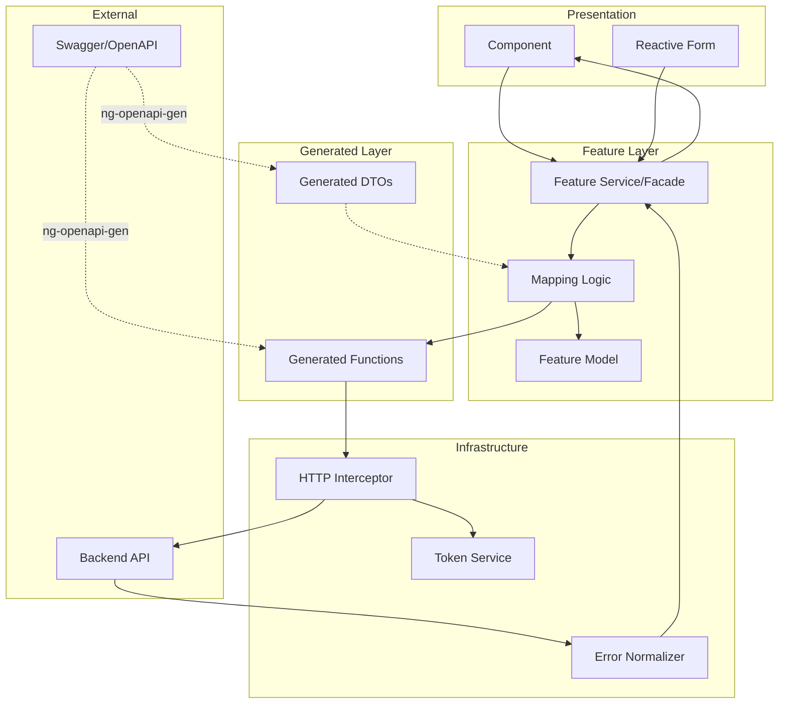
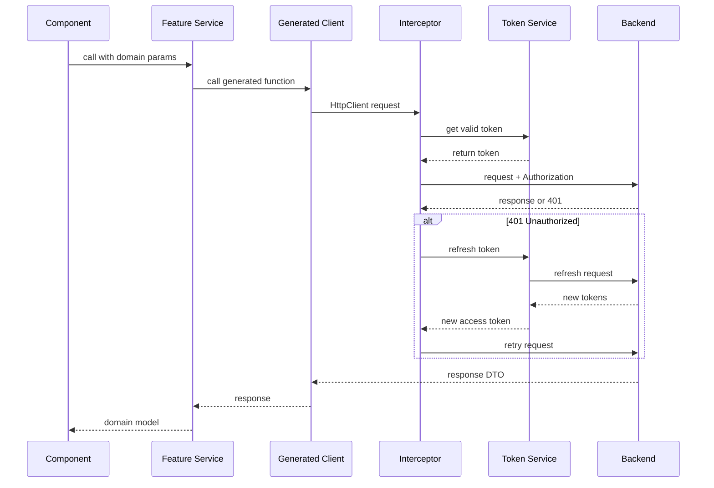
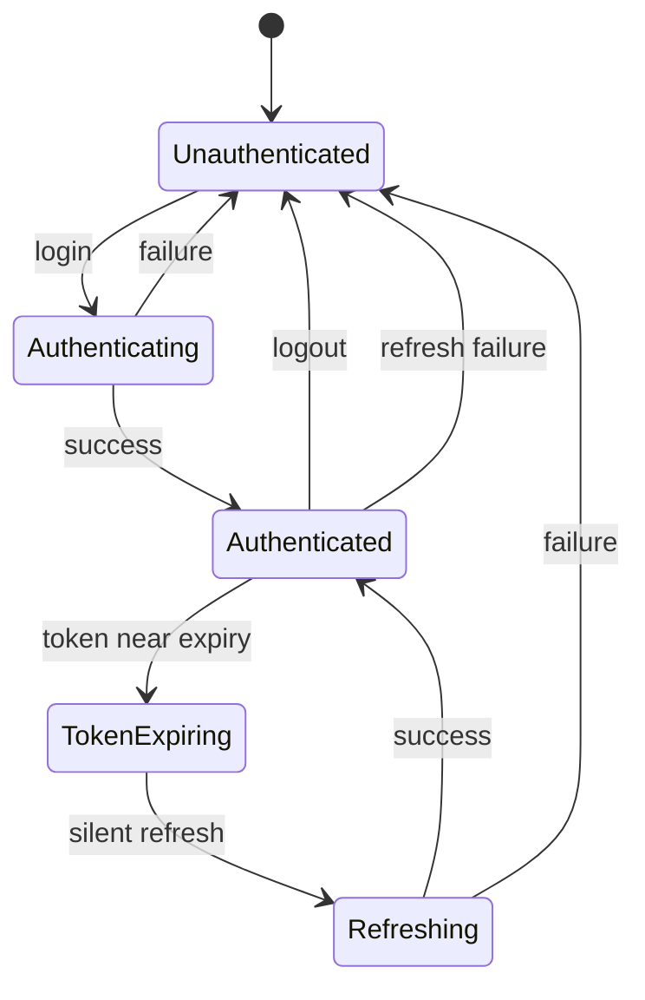
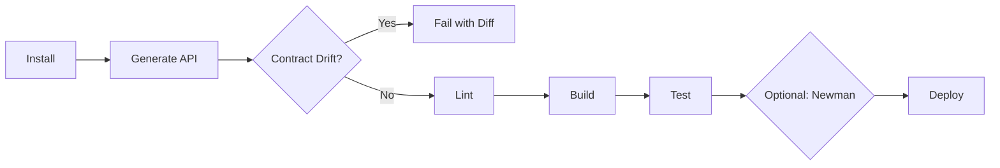
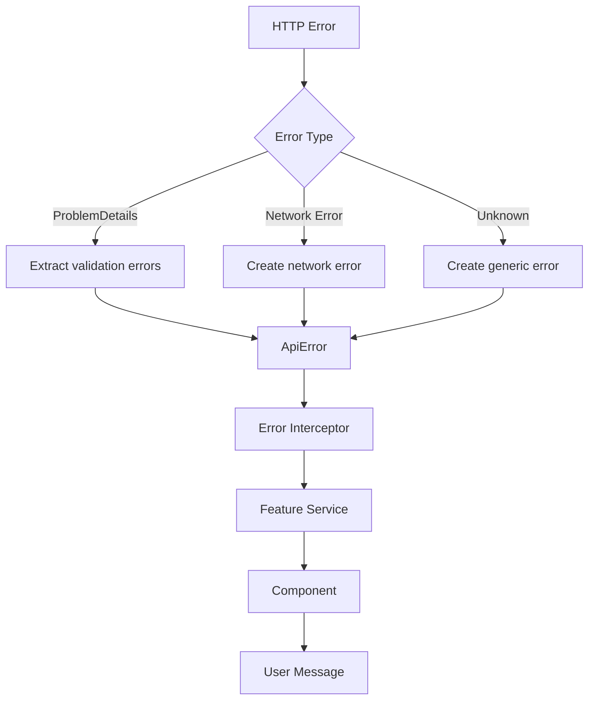

# Enterprise API Integration Architecture
## Production-Grade, Contract-Enforced, Maintainable System

---

## Executive Summary

This document defines a **pragmatic, production-grade architecture** for API integration between the Angular 20 frontend and ASP.NET Core backend. The design balances enterprise best practices with realistic implementation constraints, treating Swagger/OpenAPI as the single source of truth while avoiding over-engineering.

**Key Principles:**
- Swagger/OpenAPI is the source of truth for types and endpoints
- Feature-first organization for discoverability
- Minimal layer abstraction (Generated → Facade → Component)
- Postman MCP as optional enhancement, not requirement
- Incremental migration with continuous delivery

---

## Table of Contents

1. [Core Architectural Principles](#1-core-architectural-principles)
2. [System Architecture Overview](#2-system-architecture-overview)
3. [Folder Structure](#3-folder-structure)
4. [Layer Design](#4-layer-design)
5. [Authentication System](#5-authentication-system)
6. [HTTP Interceptor Design](#6-http-interceptor-design)
7. [Adapter Strategy](#7-adapter-strategy)
8. [Contract Enforcement](#8-contract-enforcement)
9. [CI/CD Pipeline](#9-cicd-pipeline)
10. [Postman MCP Integration](#10-postman-mcp-integration)
11. [Migration Strategy](#11-migration-strategy)
12. [Error Handling](#12-error-handling)
13. [Risk Mitigation](#13-risk-mitigation)
14. [Implementation Roadmap](#14-implementation-roadmap)

---

## 1. Core Architectural Principles

### The Seven Pillars

| # | Principle | Enforcement |
|---|-----------|-------------|
| 1 | **Swagger is the single source of truth** | All API types come from `ng-openapi-gen` |
| 2 | **Never modify generated code** | Generated folder is read-only, reproducible |
| 3 | **Feature-first organization** | Business logic lives with features, not in global folders |
| 4 | **No fragile URL checks** | Use `HttpContextToken` for auth skipping, never URL matching |
| 5 | **Contract drift detection in CI** | Regenerate and diff; fail fast on changes |
| 6 | **Centralized auth state** | Token lifecycle managed via signals/observables |
| 7 | **Pragmatic automation** | Postman MCP is optional; use where it adds value |

### What We Avoid

- ❌ Heavy cross-cutting adapter layers (keep mapping with features)
- ❌ Auto-generating UI from schemas (OpenAPI lacks UI intent)
- ❌ Mandatory Postman integration (optional enhancement)
- ❌ Complex swagger hash locking (simple regenerate-and-diff is sufficient)
- ❌ Direct HttpClient calls in components

---

## 2. System Architecture Overview

### Simplified Layer Diagram



### Request Lifecycle



---

## 3. Folder Structure

### Recommended Organization

```
src/app/
├── core/
│   ├── api/
│   │   └── generated/              # AUTO-GENERATED - DO NOT EDIT
│   │       ├── api-configuration.ts
│   │       ├── functions.ts
│   │       ├── models.ts
│   │       └── fn/
│   │
│   ├── auth/
│   │   ├── token.service.ts        # Token management with signals
│   │   ├── refresh-queue.service.ts # Prevent parallel refreshes
│   │   └── auth.guard.ts           # Route protection
│   │
│   ├── http/
│   │   ├── context-tokens.ts       # HttpContextToken definitions
│   │   └── interceptors/
│   │       ├── auth.interceptor.ts
│   │       └── error.interceptor.ts
│   │
│   └── errors/
│       ├── api-error.model.ts
│       └── error-normalizer.ts
│
├── pages/                          # Feature-first organization
│   ├── academy/
│   │   ├── services/
│   │   │   └── course.facade.ts    # Feature-specific facade
│   │   ├── models/
│   │   │   └── course.model.ts     # Feature domain model
│   │   └── components/
│   │
│   ├── auth/
│   │   ├── services/
│   │   │   └── identity.facade.ts
│   │   └── components/
│   │
│   └── events/
│       ├── services/
│       │   └── event.facade.ts
│       └── models/
│
└── shared/                         # Truly shared utilities only
    └── utils/
```

### Key Decisions

| Decision | Rationale |
|----------|-----------|
| Feature services in feature folders | Discoverability, reduced cognitive load |
| No global `adapters/` folder | Mapping logic stays with the feature that uses it |
| Minimal `core/` contents | Only truly cross-cutting concerns |
| Generated code isolated | Clear boundary, never modified |

---

## 4. Layer Design

### 4.1 Generated Layer

**Location:** `src/app/core/api/generated/`

**Rules:**
- Never modify any file in this directory
- All files regenerated via `npm run generate:api`
- Committed to git for reproducibility

**Configuration:**
```json
// ng-openapi-gen.json
{
  "$schema": "node_modules/ng-openapi-gen/ng-openapi-gen-schema.json",
  "input": "https://askamusslimapi.runasp.net/swagger/v1/swagger.json",
  "output": "src/app/core/api/generated",
  "ignoreUnusedModels": false,
  "modelIndex": true,
  "serviceIndex": true,
  "enumWithValues": true,
  "dateFormat": "string"
}
```

### 4.2 Feature Service Layer

**Purpose:** Encapsulate API calls, handle mapping, manage state

**Responsibilities:**
- Call generated API functions
- Map DTOs to/from domain models
- Handle loading states with signals
- Expose domain-friendly methods only

**Pattern:**
```typescript
// Feature service pattern (conceptual)
@Injectable({ providedIn: 'root' })
export class CourseFacade {
  // State with signals
  private readonly _loading = signal(false);
  private readonly _error = signal<string | null>(null);
  
  // Public readonly signals
  readonly loading = this._loading.asReadonly();
  readonly error = this._error.asReadonly();
  
  // Methods that use generated client and map to domain
  getAll(): Observable<Course[]> {
    this._loading.set(true);
    return apiCourseGetCoursesGetJson(this.http, this.config.rootUrl).pipe(
      map(response => this.mapToDomain(response.body ?? [])),
      tap(() => this._loading.set(false)),
      catchError(err => this.handleError(err))
    );
  }
  
  // Mapping logic kept private, within feature
  private mapToDomain(dtos: CourseReadDto[]): Course[] { ... }
}
```

### 4.3 Infrastructure Layer

**Components:**
- **Token Service:** JWT lifecycle management
- **Refresh Queue:** Prevent parallel token refreshes
- **Auth Interceptor:** Attach tokens, handle 401s
- **Error Normalizer:** Convert backend errors to domain errors

---

## 5. Authentication System

### 5.1 Token Service Design

**Responsibilities:**
- Store tokens in memory-first with localStorage fallback
- Expose reactive auth state via signals
- Provide valid token (refresh if expiring soon)
- Clear tokens on logout/refresh failure

**State Model:**
```typescript
// Conceptual interface
interface TokenState {
  accessToken: string | null;
  refreshToken: string | null;
  expiresAt: number | null;
  isAuthenticated: boolean;
  isExpiringSoon: boolean;
}
```

### 5.2 Refresh Queue Design

**Purpose:** Ensure only one refresh operation at a time

**Behavior:**
1. If refresh in progress, queue the request
2. When refresh completes, resolve all queued requests
3. If refresh fails, clear tokens and redirect to login

### 5.3 Authentication Flow



---

## 6. HTTP Interceptor Design

### 6.1 HttpContextToken Pattern

**Why HttpContextToken?**
- No fragile URL matching
- Explicit, type-safe configuration
- Request-scoped, not global

**Token Definitions:**
```typescript
// Conceptual structure
export const SKIP_AUTH = new HttpContextToken<boolean>(() => false);
export const SKIP_ERROR_HANDLING = new HttpContextToken<boolean>(() => false);
export const RETRY_COUNT = new HttpContextToken<number>(() => 0);
```

**Usage:**
```typescript
// Skipping auth for a specific request
this.http.get(url, {
  context: new HttpContext().set(SKIP_AUTH, true)
});
```

### 6.2 Interceptor Behavior

**Outgoing Request:**
1. Check `SKIP_AUTH` token
2. If not skipped, get valid token from TokenService
3. Attach `Authorization: Bearer <token>` header

**Incoming Response:**
1. On 401: trigger refresh queue, retry once
2. On other errors: delegate to error normalizer
3. On refresh failure: clear tokens, redirect to login

### 6.3 Functional Interceptor (Angular 20)

```typescript
// Conceptual structure
export const authInterceptor: HttpInterceptorFn = (req, next) => {
  const tokenService = inject(TokenService);
  const refreshQueue = inject(RefreshQueueService);
  
  if (req.context.get(SKIP_AUTH)) {
    return next(req);
  }
  
  return tokenService.getValidToken().pipe(
    switchMap(token => next(addAuthHeader(req, token))),
    catchError(error => {
      if (error.status === 401) {
        return refreshQueue.queueRefresh().pipe(
          switchMap(newToken => next(addAuthHeader(req, newToken)))
        );
      }
      return throwError(() => error);
    })
  );
};
```

---

## 7. Adapter Strategy

### 7.1 Pragmatic Approach

**Decision:** Do NOT create a global `adapters/` layer by default.

**Rationale:**
- Mapping logic is feature-specific
- Reduces indirection and cognitive load
- Keeps code discoverable

**When to create shared adapters:**
- Same DTO used by multiple features
- Complex mapping logic worth reusing
- Clear cross-cutting concern

### 7.2 Mapping Patterns

**Pattern 1: Inline Mapping in Feature Service**
```typescript
// Simple mapping within facade
private mapToDomain(dto: CourseReadDto): Course {
  return {
    id: dto.id ?? '',
    title: dto.title ?? '',
    level: this.safeEnum(dto.level, CourseLevel, CourseLevel.Beginner),
    // ... other fields with null safety
  };
}
```

**Pattern 2: Shared Mapping Utilities**
```typescript
// core/utils/mapping-helpers.ts
export function safeEnum<T extends Record<string, string>>(
  value: string | null | undefined,
  enumType: T,
  fallback: T[keyof T]
): T[keyof T] {
  if (!value) return fallback;
  return Object.values(enumType).includes(value as T[keyof T])
    ? value as T[keyof T]
    : fallback;
}

export function safeDate(value: string | null | undefined): Date | null {
  return value ? new Date(value) : null;
}
```

### 7.3 Null Safety Strategy

**Rules:**
- Always provide fallback values for required fields
- Use `??` for null coalescing
- Map backend enums to frontend-safe values
- Never pass raw DTOs to components

---

## 8. Contract Enforcement

### 8.1 Simple Regenerate-and-Diff Strategy

**Recommended Approach:**
1. In CI, run `npm run generate:api`
2. Check if generated files changed: `git diff --exit-code src/app/core/api/generated/`
3. If changed, fail the build with clear message

**Why not swagger hash lock?**
- Adds operational overhead
- Regenerate-and-diff is simpler and equally effective
- Git diff shows exactly what changed

### 8.2 CI Workflow

```yaml
# Conceptual workflow
- name: Regenerate API client
  run: npm run generate:api

- name: Check for contract drift
  run: |
    if git diff --exit-code src/app/core/api/generated/; then
      echo "✅ No contract drift"
    else
      echo "❌ CONTRACT DRIFT DETECTED"
      echo "Backend API has changed. Review diff above."
      echo "If intentional: commit the generated changes"
      exit 1
    fi
```

### 8.3 Handling Contract Changes

**When contract changes detected:**
1. Review the diff in CI output
2. If intentional backend change:
   - Run `npm run generate:api` locally
   - Update affected facades and models
   - Commit generated changes together with facade updates
3. If unintentional:
   - Coordinate with backend team
   - Do not merge until resolved

---

## 9. CI/CD Pipeline

### 9.1 Pipeline Stages



### 9.2 GitHub Actions Workflow

```yaml
name: Build and Validate

on:
  push:
    branches: [main, dev]
  pull_request:
    branches: [main, dev]

jobs:
  build:
    runs-on: ubuntu-latest
    steps:
      - uses: actions/checkout@v4
        with:
          fetch-depth: 0
      
      - name: Setup Node
        uses: actions/setup-node@v4
        with:
          node-version: '20'
          cache: 'npm'
      
      - name: Install
        run: npm ci
      
      - name: Generate API Client
        run: npm run generate:api
      
      - name: Check Contract Drift
        run: |
          if git diff --exit-code src/app/core/api/generated/; then
            echo "✅ Contract validated"
          else
            echo "❌ CONTRACT DRIFT - Review diff above"
            exit 1
          fi
      
      - name: Lint
        run: npm run lint --if-present
      
      - name: Build
        run: npm run build
      
      - name: Test
        run: npm run test -- --no-watch --browsers=ChromeHeadless

  # Optional: Newman tests
  postman:
    runs-on: ubuntu-latest
    needs: build
    if: github.event_name == 'push'
    steps:
      - uses: actions/checkout@v4
      
      - name: Run Newman
        run: |
          npm install -g newman
          newman run postman_collection.json \
            --environment postman_environment.json
        continue-on-error: true
```

---

## 10. Postman MCP Integration

### 10.1 Role: Optional Enhancement

**Postman MCP is NOT required** for the architecture to work. It's an optional enhancement for teams that:
- Already use Postman for API testing
- Want automated collection runs in CI
- Benefit from schema exploration in IDE

### 10.2 When to Use MCP

| Use Case | Benefit |
|----------|---------|
| Schema exploration in IDE | Quick reference without browser |
| Running collections from VS Code | Faster development cycle |
| CI integration via Newman | Automated API testing |
| Token management in Postman | Easier manual testing |

### 10.3 MCP Configuration

```json
// .vscode/mcp.json
{
  "servers": {
    "postman": {
      "type": "http",
      "url": "https://mcp.postman.com/mcp",
      "headers": {
        "x-api-key": "${POSTMAN_API_KEY}"
      }
    }
  }
}
```

### 10.4 Postman Environment

```json
{
  "name": "AskAMuslim - Dev",
  "values": [
    { "key": "baseUrl", "value": "https://askamusslimapi.runasp.net" },
    { "key": "jwt", "value": "" },
    { "key": "refreshToken", "value": "" }
  ]
}
```

### 10.5 Login Test Script

```javascript
// Postman test script for login endpoint
if (pm.response.code === 200) {
  const body = pm.response.json();
  pm.environment.set("jwt", body.accessToken);
  pm.environment.set("refreshToken", body.refreshToken);
  
  pm.test("Has accessToken", () => {
    pm.expect(body.accessToken).to.be.a('string');
  });
}
```

---

## 11. Migration Strategy

### 11.1 Feature-by-Feature Migration

**Approach:** Migrate one feature at a time, starting with highest impact.

**Priority Order:**
1. **Auth/Identity** - Unblocks secure testing
2. **Courses** - Core feature
3. **Enrollments** - Core feature
4. **Events** - If endpoints in Swagger
5. **Other features** - As needed

### 11.2 Migration Checklist Per Feature

```markdown
## Feature Migration: [Feature Name]

### Pre-Migration
- [ ] Verify all endpoints exist in Swagger
- [ ] Identify all usages of legacy service

### Implementation
- [ ] Create feature domain model
- [ ] Create/update feature facade with generated client
- [ ] Add mapping logic (inline or helper)
- [ ] Update components to use facade
- [ ] Remove legacy endpoint constants usage

### Validation
- [ ] Unit tests pass
- [ ] Manual testing complete
- [ ] No TypeScript errors

### Cleanup
- [ ] Remove or deprecate legacy service
- [ ] Update documentation
```

### 11.3 Legacy Service Audit

| Service | Status | In Swagger | Priority |
|---------|--------|------------|----------|
| ApiService | Generic legacy | N/A | Remove after migration |
| AuthService | Partial | ✅ | HIGH |
| CourseService | Partial | ✅ | HIGH |
| EventsService | Legacy | ❌ | Backend needed |
| MuslimTubeService | Legacy | ❌ | Low priority |

---

## 12. Error Handling

### 12.1 Domain Error Model

```typescript
interface ApiError {
  statusCode: number;
  message: string;
  validationErrors: Record<string, string[]>;
  traceId: string | null;
  timestamp: Date;
  // Computed flags
  isNetworkError: boolean;
  isAuthError: boolean;
  isValidationError: boolean;
}
```

### 12.2 Error Normalization

**Responsibilities:**
- Convert `HttpErrorResponse` to `ApiError`
- Handle `ProblemDetails` from ASP.NET Core
- Extract validation errors
- Provide user-friendly messages

**Location:** `src/app/core/errors/error-normalizer.ts`

### 12.3 Error Flow



---

## 13. Risk Mitigation

### 13.1 Risk Matrix

| Risk | Probability | Impact | Mitigation |
|------|-------------|--------|------------|
| Backend breaking changes | Medium | High | CI drift detection + null-safe mapping |
| Token expiration during request | High | Medium | Silent refresh + retry queue |
| Network instability | Medium | Medium | Retry logic with backoff |
| Partial Swagger exposure | Low | High | Feature-first migration + backend coordination |
| Enum mismatches | Medium | Low | Safe enum mapping with fallbacks |
| Over-automation | Medium | Medium | Pragmatic approach, avoid generating UI |

### 13.2 Mitigation Strategies

**Backend Breaking Changes:**
- CI detects contract drift immediately
- Null-safe mapping provides fallbacks
- Feature isolation limits blast radius

**Token Expiration:**
- Proactive refresh 1 minute before expiry
- Reactive refresh on 401
- Single refresh queue prevents race conditions

**Network Instability:**
- Configurable retry count via HttpContextToken
- Exponential backoff between retries

---

## 14. Implementation Roadmap

### Phase A: Core Hardening (1-2 days)

**Goal:** Establish foundation for secure, reliable API calls

**Tasks:**
- [ ] Create `HttpContextToken` definitions
- [ ] Implement `TokenService` with signals
- [ ] Implement `RefreshQueueService`
- [ ] Create `AuthInterceptor` (functional)
- [ ] Create `ErrorNormalizer`
- [ ] Register interceptors in `app.config.ts`
- [ ] Add CI contract drift check

**Deliverable:** Working auth flow with token refresh

### Phase B: Auth Migration (1 day)

**Goal:** Migrate authentication to generated client

**Tasks:**
- [ ] Update `IdentityFacade` to use generated functions
- [ ] Update login/register components
- [ ] Remove legacy auth endpoint constants
- [ ] Test complete auth flow

**Deliverable:** Auth fully migrated

### Phase C: Feature Migration (2-3 days)

**Goal:** Migrate high-value features

**Tasks:**
- [ ] Migrate Courses feature
- [ ] Migrate Enrollments feature
- [ ] Migrate 1-2 additional features
- [ ] Remove legacy services as features migrate

**Deliverable:** Core features using generated client

### Phase D: Optional Enhancements (1-3 days)

**Goal:** Add optional improvements

**Tasks:**
- [ ] Configure Postman MCP (if team uses Postman)
- [ ] Add Newman CI job (optional)
- [ ] Create shared mapping utilities as needed
- [ ] Documentation updates

**Deliverable:** Enhanced developer experience

---

## Appendix: Quick Reference

### Key Files to Create

| File | Purpose |
|------|---------|
| `src/app/core/http/context-tokens.ts` | HttpContextToken definitions |
| `src/app/core/auth/token.service.ts` | Token management with signals |
| `src/app/core/auth/refresh-queue.service.ts` | Prevent parallel refreshes |
| `src/app/core/http/interceptors/auth.interceptor.ts` | JWT injection + refresh |
| `src/app/core/http/interceptors/error.interceptor.ts` | Global error handling |
| `src/app/core/errors/error-normalizer.ts` | Error normalization |
| `.github/workflows/api-contract.yml` | CI contract validation |

### Key Commands

```bash
# Generate API client
npm run generate:api

# Run tests
npm run test

# Build
npm run build

# Lint
npm run lint
```

### Decision Log

| Decision | Choice | Rationale |
|----------|--------|-----------|
| Adapter layer | Feature-local | Discoverability, reduced indirection |
| Contract enforcement | Regenerate-and-diff | Simpler than hash lock, equally effective |
| Postman MCP | Optional | Not all teams use Postman |
| Form scaffolding | Manual | OpenAPI lacks UI intent |
| Feature organization | Feature-first | Aligns with Angular best practices |

---

*Document Version: 2.0*
*Last Updated: 2026-02-12*
*Status: Final*
