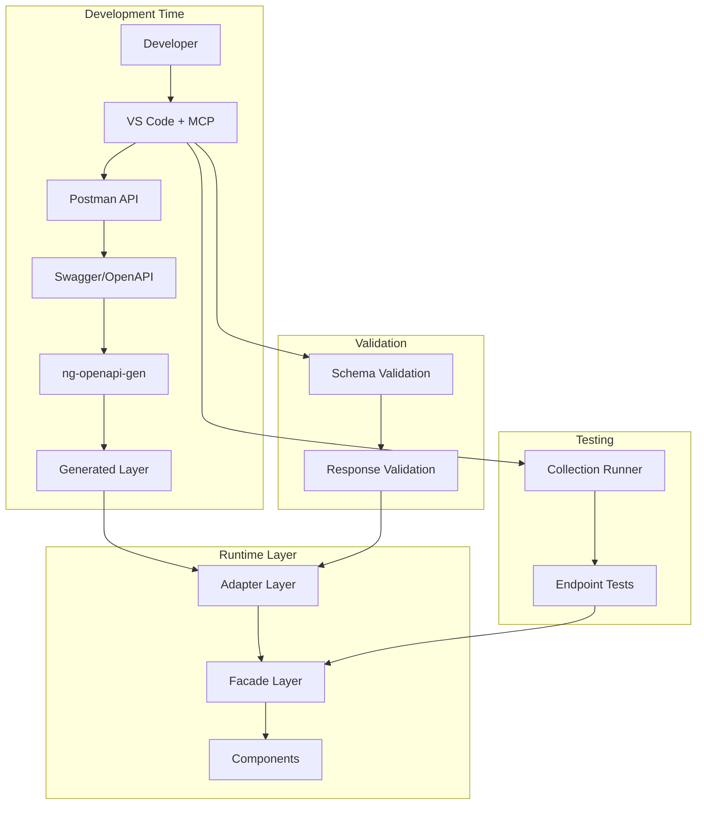
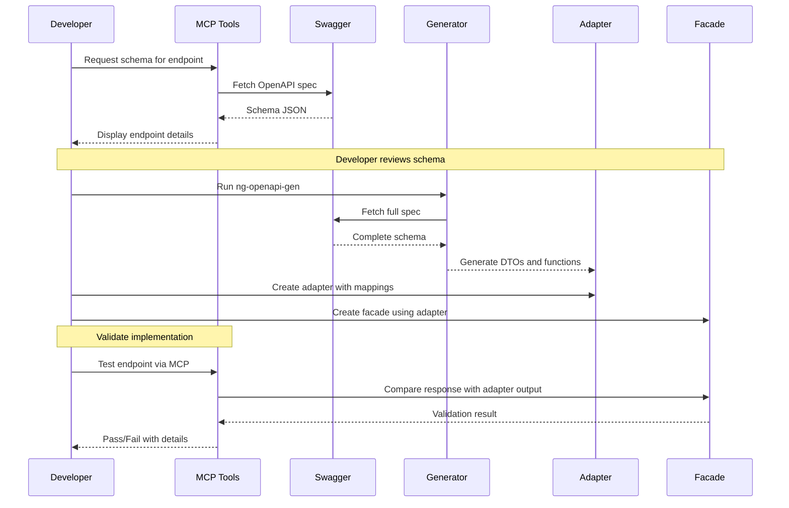

# MCP Integration with Facades and Adapters
## Bridging Postman MCP with the Angular Layer Architecture

---

## Table of Contents

1. [Integration Overview](#1-integration-overview)
2. [MCP as Development Accelerator](#2-mcp-as-development-accelerator)
3. [Facade-MCP Integration Patterns](#3-facade-mcp-integration-patterns)
4. [Adapter-MCP Integration Patterns](#4-adapter-mcp-integration-patterns)
5. [Automated Type Generation from MCP](#5-automated-type-generation-from-mcp)
6. [Runtime Validation with MCP](#6-runtime-validation-with-mcp)
7. [Development Workflow Integration](#7-development-workflow-integration)
8. [Testing Integration](#8-testing-integration)
9. [Complete Integration Examples](#9-complete-integration-examples)

---

## 1. Integration Overview

### 1.1 Where MCP Fits in the Architecture



### 1.2 MCP Integration Points

| Integration Point | Purpose | When Used |
|-------------------|---------|-----------|
| **Schema Discovery** | Understand endpoint structure before coding | Development time |
| **Type Generation** | Generate domain models from schema | Pre-build |
| **Adapter Validation** | Verify adapter mappings are correct | Development/Test |
| **Facade Testing** | Test facade methods against real API | Development/Test |
| **Response Validation** | Runtime schema validation | Optional runtime |
| **Contract Enforcement** | Ensure frontend-backend alignment | CI/CD |

---

## 2. MCP as Development Accelerator

### 2.1 From Schema to Implementation



### 2.2 MCP-Assisted Development Commands

```typescript
// scripts/mcp-dev-assist.ts
// CLI tool for MCP-assisted development

interface EndpointInfo {
  path: string;
  method: string;
  requestSchema: any;
  responseSchema: any;
  generatedFunction: string;
  generatedDto: string;
}

class MCPDevAssistant {
  /**
   * Get complete endpoint information for development
   */
  async getEndpointInfo(endpoint: string, method: string): Promise<EndpointInfo> {
    // 1. Fetch schema via MCP
    const schema = await this.fetchSchemaViaMCP();
    
    // 2. Extract endpoint details
    const endpointSchema = schema.paths[endpoint]?.[method.toLowerCase()];
    if (!endpointSchema) {
      throw new Error(`Endpoint ${method} ${endpoint} not found in schema`);
    }
    
    // 3. Map to generated artifacts
    const generatedFunction = this.mapToGeneratedFunction(endpoint, method);
    const generatedDto = this.mapToGeneratedDto(endpointSchema.responses);
    
    return {
      path: endpoint,
      method: method.toUpperCase(),
      requestSchema: endpointSchema.requestBody?.content?.['application/json']?.schema,
      responseSchema: endpointSchema.responses?.['200']?.content?.['application/json']?.schema,
      generatedFunction,
      generatedDto
    };
  }
  
  /**
   * Generate adapter code template
   */
  generateAdapterTemplate(endpointInfo: EndpointInfo): string {
    return `
// Auto-generated adapter template for ${endpointInfo.method} ${endpointInfo.path}
// Review and customize as needed

import { Injectable } from '@angular/core';
import { BaseAdapter } from './base.adapter';
import { ${endpointInfo.generatedDto} } from '../generated/models';

export interface Domain${endpointInfo.generatedDto.replace('Dto', '')} {
  // Define domain model properties here
  // Map from: ${JSON.stringify(endpointInfo.responseSchema, null, 2)}
}

@Injectable({ providedIn: 'root' })
export class ${endpointInfo.generatedDto.replace('Dto', '')}Adapter 
  extends BaseAdapter<${endpointInfo.generatedDto}, Domain${endpointInfo.generatedDto.replace('Dto', '')}> {
  
  toDomain(dto: ${endpointInfo.generatedDto}): Domain${endpointInfo.generatedDto.replace('Dto', '')} {
    return {
      // Map DTO to domain model
    };
  }
  
  toDto(domain: Partial<Domain${endpointInfo.generatedDto.replace('Dto', '')}>): Partial<${endpointInfo.generatedDto}> {
    return {
      // Map domain model to DTO
    };
  }
}
`;
  }
  
  private async fetchSchemaViaMCP(): Promise<any> {
    // MCP tool call: postman_get_api_schema
    return {};
  }
  
  private mapToGeneratedFunction(endpoint: string, method: string): string {
    // Convert /api/Course/GetCourses -> apiCourseGetCoursesGetJson
    const parts = endpoint.split('/').filter(Boolean);
    const path = parts.map(p => p.replace(/{.*}/, '')).join('');
    return `api${path}${method.charAt(0).toUpperCase() + method.slice(1)}`;
  }
  
  private mapToGeneratedDto(responses: any): string {
    // Extract DTO name from response schema
    return 'CourseReadDto';
  }
}

// Usage
const assistant = new MCPDevAssistant();
const info = await assistant.getEndpointInfo('/api/Course/GetCourses', 'GET');
console.log(assistant.generateAdapterTemplate(info));
```

---

## 3. Facade-MCP Integration Patterns

### 3.1 Pattern 1: MCP-Validated Facade

**Purpose:** Use MCP to validate facade responses during development.

```typescript
// src/app/core/api/facades/course.facade.ts
import { Injectable, inject } from '@angular/core';
import { HttpClient } from '@angular/common/http';
import { Observable, tap, map } from 'rxjs';
import { ApiConfiguration } from '../generated/api-configuration';
import { apiCourseGetCoursesGetJson } from '../generated/fn/course/api-course-get-courses-get-json';
import { CourseReadDto } from '../generated/models/course-read-dto';
import { CourseAdapter, Course } from '../adapters/course.adapter';

@Injectable({ providedIn: 'root' })
export class CourseFacade {
  private readonly http = inject(HttpClient);
  private readonly config = inject(ApiConfiguration);
  private readonly adapter = inject(CourseAdapter);
  
  /**
   * Get all courses
   * MCP Validation: Run postman_validate_schema on response
   */
  getAllCourses(): Observable<Course[]> {
    return apiCourseGetCoursesGetJson(this.http, this.config.rootUrl).pipe(
      map(response => this.adapter.toDomainArray(response.body ?? [])),
      
      // Development mode: Validate response via MCP
      tap({
        next: (courses) => {
          if (this.isDevelopmentMode()) {
            this.validateViaMCP('/api/Course/GetCourses', 'GET', courses);
          }
        }
      })
    );
  }
  
  private isDevelopmentMode(): boolean {
    return !ngDevMode?.isDevMode?.();
  }
  
  private async validateViaMCP(endpoint: string, method: string, data: any): Promise<void> {
    // This would call MCP validation in development
    // In production, this is a no-op
    console.debug(`[MCP Validation] ${method} ${endpoint}`, data);
  }
}
```

### 3.2 Pattern 2: MCP-Driven Facade Generation

**Purpose:** Generate facade methods from MCP schema information.

```typescript
// scripts/generate-facade-methods.ts
interface FacadeMethodConfig {
  name: string;
  endpoint: string;
  method: 'GET' | 'POST' | 'PUT' | 'DELETE';
  generatedFunction: string;
  requestDto: string;
  responseDto: string;
  domainModel: string;
  adapterName: string;
}

function generateFacadeMethod(config: FacadeMethodConfig): string {
  const hasBody = ['POST', 'PUT'].includes(config.method);
  const hasId = config.endpoint.includes('{id}');
  
  return `
  /**
   * ${config.name}
   * Endpoint: ${config.method} ${config.endpoint}
   * MCP Schema: Validated against ${config.responseDto}
   */
  ${camelCase(config.name)}(${hasBody ? `data: ${config.domainModel}` : ''}${hasId ? 'id: string' : ''}): Observable<${config.responseDto === 'void' ? 'void' : config.domainModel + (config.method === 'GET' && !hasId ? '[]' : '')}> {
    ${hasBody ? `const dto = this.adapter.toDto(data);` : ''}
    return ${config.generatedFunction}(
      this.http,
      this.config.rootUrl,
      ${hasBody ? '{ body: dto }' : hasId ? '{ id }' : ''}
    ).pipe(
      map(response => ${config.responseDto === 'void' ? 'undefined' : 'this.adapter.toDomain(response.body!)'}),
      catchError(this.handleError)
    );
  }
`;
}

// Generate from MCP schema
async function generateFacadeFromMCP(entityName: string): Promise<string> {
  // 1. Fetch schema via MCP
  const schema = await fetchSchemaViaMCP();
  
  // 2. Find all endpoints for this entity
  const endpoints = Object.entries(schema.paths)
    .filter(([path]) => path.toLowerCase().includes(entityName.toLowerCase()))
    .flatMap(([path, methods]) => 
      Object.entries(methods as any)
        .filter(([method]) => ['get', 'post', 'put', 'delete'].includes(method))
        .map(([method, spec]) => ({ path, method: method.toUpperCase(), spec }))
    );
  
  // 3. Generate facade methods
  const methods = endpoints.map(ep => generateFacadeMethod({
    name: ep.spec.summary || `${ep.method} ${entityName}`,
    endpoint: ep.path,
    method: ep.method as any,
    generatedFunction: mapToGeneratedFunction(ep.path, ep.method),
    requestDto: extractRequestDto(ep.spec),
    responseDto: extractResponseDto(ep.spec),
    domainModel: entityName,
    adapterName: `${entityName}Adapter`
  }));
  
  return `
import { Injectable, inject } from '@angular/core';
import { HttpClient } from '@angular/common/http';
import { Observable, map, catchError } from 'rxjs';
import { ApiConfiguration } from '../generated/api-configuration';
import { ${entityName}Adapter, ${entityName} } from '../adapters/${entityName.toLowerCase()}.adapter';

// Auto-generated facade from MCP schema
// Generated: ${new Date().toISOString()}

@Injectable({ providedIn: 'root' })
export class ${entityName}Facade {
  private readonly http = inject(HttpClient);
  private readonly config = inject(ApiConfiguration);
  private readonly adapter = inject(${entityName}Adapter);
  
${methods.join('\n')}
  
  private handleError(error: any): Observable<never> {
    console.error('[${entityName}Facade]', error);
    throw error;
  }
}
`;
}
```

### 3.3 Pattern 3: Facade Testing with MCP

**Purpose:** Use MCP to test facades against real API responses.

```typescript
// src/app/core/api/facades/__tests__/course.facade.mcp.spec.ts
import { TestBed } from '@angular/core/testing';
import { CourseFacade } from '../course.facade';
import { MCPTestHelper } from '../../../../testing/mcp-test-helper';

describe('CourseFacade - MCP Integration Tests', () => {
  let facade: CourseFacade;
  let mcpHelper: MCPTestHelper;
  
  beforeAll(async () => {
    // Initialize MCP connection for testing
    mcpHelper = new MCPTestHelper({
      apiKey: process.env['POSTMAN_API_KEY'],
      collectionId: process.env['COLLECTION_ID'],
      environmentId: process.env['ENVIRONMENT_ID']
    });
    
    await mcpHelper.authenticate();
  });
  
  beforeEach(() => {
    TestBed.configureTestingModule({});
    facade = TestBed.inject(CourseFacade);
  });
  
  describe('getAllCourses', () => {
    it('should return courses matching MCP schema', async () => {
      // 1. Get expected schema from MCP
      const schema = await mcpHelper.getEndpointSchema('/api/Course/GetCourses', 'GET');
      
      // 2. Execute facade method
      const courses = await firstValueFrom(facade.getAllCourses());
      
      // 3. Validate response against schema
      const validation = await mcpHelper.validateAgainstSchema(courses, schema);
      
      expect(validation.valid).toBe(true);
      expect(validation.errors).toEqual([]);
    });
    
    it('should handle response shape changes gracefully', async () => {
      // 1. Get actual API response via MCP
      const actualResponse = await mcpHelper.executeRequest({
        method: 'GET',
        url: '/api/Course/GetCourses'
      });
      
      // 2. Get facade response
      const facadeResponse = await firstValueFrom(facade.getAllCourses());
      
      // 3. Compare structures
      const comparison = mcpHelper.compareStructures(actualResponse, facadeResponse);
      
      // Adapter should normalize any differences
      expect(comparison.compatible).toBe(true);
    });
  });
});
```

---

## 4. Adapter-MCP Integration Patterns

### 4.1 Pattern 1: Schema-Driven Adapter Generation

**Purpose:** Generate adapter mappings from MCP schema information.

```typescript
// scripts/generate-adapter-from-mcp.ts
interface SchemaProperty {
  name: string;
  type: string;
  format?: string;
  required: boolean;
  nullable: boolean;
  description?: string;
  enum?: string[];
  items?: SchemaProperty;
  properties?: Record<string, SchemaProperty>;
}

interface AdapterMapping {
  dtoProperty: string;
  domainProperty: string;
  dtoType: string;
  domainType: string;
  transformation: 'direct' | 'enum' | 'date' | 'array' | 'nested' | 'nullable';
  defaultValue?: any;
}

class MCPAdapterGenerator {
  /**
   * Generate adapter from MCP schema
   */
  async generateAdapter(dtoName: string): Promise<string> {
    // 1. Fetch schema via MCP
    const schema = await this.fetchSchemaViaMCP();
    
    // 2. Extract DTO properties
    const dtoSchema = schema.components?.schemas?.[dtoName];
    if (!dtoSchema) {
      throw new Error(`DTO ${dtoName} not found in schema`);
    }
    
    // 3. Generate mappings
    const mappings = this.generateMappings(dtoSchema);
    
    // 4. Generate adapter code
    return this.generateAdapterCode(dtoName, mappings);
  }
  
  private generateMappings(schema: any): AdapterMapping[] {
    const mappings: AdapterMapping[] = [];
    const required = schema.required || [];
    
    for (const [name, prop] of Object.entries(schema.properties || {})) {
      const p = prop as any;
      mappings.push({
        dtoProperty: name,
        domainProperty: this.toCamelCase(name),
        dtoType: this.mapDtoType(p),
        domainType: this.mapDomainType(p),
        transformation: this.determineTransformation(p),
        defaultValue: this.getDefaultValue(p, required.includes(name))
      });
    }
    
    return mappings;
  }
  
  private generateAdapterCode(dtoName: string, mappings: AdapterMapping[]): string {
    const domainName = dtoName.replace('Dto', '');
    
    const toDomainMappings = mappings.map(m => {
      switch (m.transformation) {
        case 'direct':
          return `    ${m.domainProperty}: dto.${m.dtoProperty}${m.defaultValue ? ` ?? ${JSON.stringify(m.defaultValue)}` : ''}`;
        case 'enum':
          return `    ${m.domainProperty}: this.safeEnum(dto.${m.dtoProperty}, ${domainName}${m.dtoProperty.replace(/^\w/, c => c.toUpperCase())}, ${domainName}${m.dtoProperty.replace(/^\w/, c => c.toUpperCase())}.${m.defaultValue})`;
        case 'date':
          return `    ${m.domainProperty}: dto.${m.dtoProperty} ? new Date(dto.${m.dtoProperty}) : null`;
        case 'array':
          return `    ${m.domainProperty}: dto.${m.dtoProperty} ?? []`;
        case 'nullable':
          return `    ${m.domainProperty}: dto.${m.dtoProperty} ?? null`;
        default:
          return `    ${m.domainProperty}: dto.${m.dtoProperty}`;
      }
    }).join(',\n');
    
    const toDtoMappings = mappings.map(m => {
      if (m.transformation === 'date') {
        return `    if (domain.${m.domainProperty} !== undefined) dto.${m.dtoProperty} = domain.${m.domainProperty}?.toISOString()`;
      }
      return `    if (domain.${m.domainProperty} !== undefined) dto.${m.dtoProperty} = domain.${m.domainProperty}`;
    }).join('\n');
    
    return `
import { Injectable } from '@angular/core';
import { BaseAdapter } from './base.adapter';
import { ${dtoName} } from '../generated/models/${this.toKebabCase(dtoName)}';

// Domain model for ${domainName}
export interface ${domainName} {
${mappings.map(m => `  ${m.domainProperty}: ${m.domainType};`).join('\n')}
}

@Injectable({ providedIn: 'root' })
export class ${domainName}Adapter extends BaseAdapter<${dtoName}, ${domainName}> {
  
  toDomain(dto: ${dtoName}): ${domainName} {
    return {
${toDomainMappings}
    };
  }
  
  toDto(domain: Partial<${domainName}>): Partial<${dtoName}> {
    const dto: Partial<${dtoName}> = {};
${toDtoMappings}
    return dto;
  }
}
`;
  }
  
  private mapDtoType(prop: any): string {
    if (prop.$ref) return prop.$ref.split('/').pop();
    if (prop.enum) return prop.enum.map((e: string) => `'${e}'`).join(' | ');
    switch (prop.type) {
      case 'string': return prop.format === 'date-time' ? 'Date' : 'string';
      case 'number':
      case 'integer': return 'number';
      case 'boolean': return 'boolean';
      case 'array': return `${this.mapDtoType(prop.items)}[]`;
      default: return 'any';
    }
  }
  
  private mapDomainType(prop: any): string {
    let type = this.mapDtoType(prop);
    if (prop.nullable || !prop.required) {
      type += ' | null';
    }
    return type;
  }
  
  private determineTransformation(prop: any): AdapterMapping['transformation'] {
    if (prop.enum) return 'enum';
    if (prop.format === 'date-time') return 'date';
    if (prop.type === 'array') return 'array';
    if (prop.nullable) return 'nullable';
    return 'direct';
  }
  
  private getDefaultValue(prop: any, required: boolean): any {
    if (prop.default !== undefined) return prop.default;
    if (prop.type === 'string') return required ? '' : null;
    if (prop.type === 'number' || prop.type === 'integer') return required ? 0 : null;
    if (prop.type === 'boolean') return false;
    if (prop.type === 'array') return [];
    return null;
  }
  
  private toCamelCase(str: string): string {
    return str.charAt(0).toLowerCase() + str.slice(1);
  }
  
  private toKebabCase(str: string): string {
    return str.replace(/([a-z])([A-Z])/g, '$1-$2').toLowerCase();
  }
  
  private async fetchSchemaViaMCP(): Promise<any> {
    // MCP tool call implementation
    return {};
  }
}
```

### 4.2 Pattern 2: Runtime Adapter Validation

**Purpose:** Validate adapter transformations at runtime using MCP.

```typescript
// src/app/core/api/adapters/validated-adapter.ts
import { Injectable, inject } from '@angular/core';
import { BaseAdapter } from './base.adapter';
import { MCPValidator } from '../../services/mcp-validator.service';

/**
 * Base class for adapters with MCP validation
 * Only active in development mode
 */
export abstract class ValidatedAdapter<TDto, TDomain> extends BaseAdapter<TDto, TDomain> {
  protected readonly mcpValidator = inject(MCPValidator, { optional: true });
  protected abstract readonly endpointPath: string;
  protected abstract readonly responseSchema: string;
  
  override toDomain(dto: TDto): TDomain {
    const domain = super.toDomain(dto);
    
    // Validate in development mode
    if (this.mcpValidator?.isEnabled()) {
      this.validateDomainModel(domain);
    }
    
    return domain;
  }
  
  private validateDomainModel(domain: TDomain): void {
    const result = this.mcpValidator!.validate(domain, this.responseSchema);
    
    if (!result.valid) {
      console.warn(
        `[Adapter Validation] ${this.constructor.name} produced invalid domain model:`,
        result.errors
      );
    }
  }
}
```

### 4.3 Pattern 3: Adapter Test Generation from MCP

**Purpose:** Generate adapter unit tests from MCP schema.

```typescript
// scripts/generate-adapter-tests.ts
function generateAdapterTests(dtoName: string, schema: any): string {
  const domainName = dtoName.replace('Dto', '');
  const properties = schema.components?.schemas?.[dtoName]?.properties || {};
  
  return `
import { ${domainName}Adapter } from './${domainName.toLowerCase()}.adapter';
import { ${dtoName} } from '../generated/models';

describe('${domainName}Adapter', () => {
  let adapter: ${domainName}Adapter;
  
  beforeEach(() => {
    adapter = new ${domainName}Adapter();
  });
  
  describe('toDomain', () => {
    it('should map all required properties', () => {
      const dto: ${dtoName} = {
${Object.entries(properties)
  .filter(([_, p]: [string, any]) => p.required)
  .map(([name, p]: [string, any]) => 
    `        ${name}: ${getTestValue(p as any)}`
  ).join(',\n')}
      };
      
      const domain = adapter.toDomain(dto);
      
      expect(domain).toBeDefined();
${Object.entries(properties)
  .filter(([_, p]: [string, any]) => p.required)
  .map(([name]: [string, any]) => 
    `      expect(domain.${name}).toBeDefined();`
  ).join('\n')}
    });
    
    it('should handle null values gracefully', () => {
      const dto: ${dtoName} = {
${Object.entries(properties)
  .map(([name]: [string, any]) => 
    `        ${name}: null`
  ).join(',\n')}
      };
      
      const domain = adapter.toDomain(dto);
      
      expect(domain).toBeDefined();
    });
  });
  
  describe('toDto', () => {
    it('should map domain to DTO correctly', () => {
      const domain = {
${Object.entries(properties)
  .slice(0, 3)
  .map(([name, p]: [string, any]) => 
    `        ${name}: ${getTestValue(p as any)}`
  ).join(',\n')}
      };
      
      const dto = adapter.toDto(domain);
      
      expect(dto).toBeDefined();
    });
  });
});

function getTestValue(prop: any): any {
  if (prop.type === 'string') return prop.format === 'date-time' ? '2024-01-01T00:00:00Z' : "'test'";
  if (prop.type === 'number' || prop.type === 'integer') return 1;
  if (prop.type === 'boolean') return true;
  if (prop.type === 'array') return [];
  if (prop.enum) return `'${prop.enum[0]}'`;
  return 'null';
}
`;
}
```

---

## 5. Automated Type Generation from MCP

### 5.1 Domain Model Generation

```typescript
// scripts/generate-domain-models.ts
interface DomainModelConfig {
  dtoName: string;
  domainName: string;
  excludeProperties: string[];
  renameProperties: Record<string, string>;
  customTypes: Record<string, string>;
}

class DomainModelGenerator {
  /**
   * Generate domain model from MCP schema
   */
  async generateDomainModel(config: DomainModelConfig): Promise<string> {
    const schema = await this.fetchSchemaViaMCP();
    const dtoSchema = schema.components?.schemas?.[config.dtoName];
    
    if (!dtoSchema) {
      throw new Error(`DTO ${config.dtoName} not found`);
    }
    
    const properties = this.processProperties(dtoSchema, config);
    
    return `
/**
 * Domain model for ${config.domainName}
 * Generated from ${config.dtoName} via MCP
 * Generated: ${new Date().toISOString()}
 */
export interface ${config.domainName} {
${properties.map(p => `  ${p.name}: ${p.type};`).join('\n')}
}

${this.generateEnums(dtoSchema, config)}
`;
  }
  
  private processProperties(schema: any, config: DomainModelConfig): Array<{ name: string; type: string }> {
    const properties: Array<{ name: string; type: string }> = [];
    const required = schema.required || [];
    
    for (const [name, prop] of Object.entries(schema.properties || {})) {
      // Skip excluded properties
      if (config.excludeProperties.includes(name)) continue;
      
      // Apply rename
      const domainName = config.renameProperties[name] || this.toCamelCase(name);
      
      // Get type
      let type = this.mapType(prop as any, config.customTypes);
      if (!required.includes(name) && !type.includes('null')) {
        type += ' | null';
      }
      
      properties.push({ name: domainName, type });
    }
    
    return properties;
  }
  
  private mapType(prop: any, customTypes: Record<string, string>): string {
    // Check for custom type mapping
    if (prop.$ref) {
      const refName = prop.$ref.split('/').pop();
      return customTypes[refName] || refName;
    }
    
    if (prop.enum) {
      return prop.enum.map((e: string) => `'${e}'`).join(' | ');
    }
    
    switch (prop.type) {
      case 'string':
        return prop.format === 'date-time' ? 'Date' : 'string';
      case 'number':
      case 'integer':
        return 'number';
      case 'boolean':
        return 'boolean';
      case 'array':
        return `${this.mapType(prop.items, customTypes)}[]`;
      default:
        return 'any';
    }
  }
  
  private generateEnums(schema: any, config: DomainModelConfig): string {
    const enums: string[] = [];
    
    for (const [name, prop] of Object.entries(schema.properties || {})) {
      const p = prop as any;
      if (p.enum) {
        const enumName = config.domainName + this.toPascalCase(name);
        enums.push(`
export enum ${enumName} {
${p.enum.map((e: string) => `  ${this.toPascalCase(e)} = '${e}',`).join('\n')}
}
`);
      }
    }
    
    return enums.join('\n');
  }
  
  private toCamelCase(str: string): string {
    return str.charAt(0).toLowerCase() + str.slice(1);
  }
  
  private toPascalCase(str: string): string {
    return str.charAt(0).toUpperCase() + str.slice(1);
  }
  
  private async fetchSchemaViaMCP(): Promise<any> {
    // Implementation
    return {};
  }
}
```

### 5.2 MCP Schema to TypeScript Type Map

```typescript
// scripts/schema-type-mapper.ts
const SCHEMA_TO_TYPESCRIPT_MAP: Record<string, string> = {
  'string': 'string',
  'string:date': 'string',
  'string:date-time': 'Date',
  'string:uri': 'string',
  'string:email': 'string',
  'string:uuid': 'string',
  'number': 'number',
  'integer': 'number',
  'boolean': 'boolean',
  'array': '[]',
  'object': 'Record<string, any>'
};

function mapSchemaToType(schemaProp: any, context: { schemas: any }): string {
  // Handle $ref
  if (schemaProp.$ref) {
    const refName = schemaProp.$ref.split('/').pop();
    return refName;
  }
  
  // Handle enum
  if (schemaProp.enum) {
    return schemaProp.enum.map((v: string) => `'${v}'`).join(' | ');
  }
  
  // Handle array
  if (schemaProp.type === 'array') {
    const itemType = mapSchemaToType(schemaProp.items, context);
    return `${itemType}[]`;
  }
  
  // Handle object with properties
  if (schemaProp.type === 'object' && schemaProp.properties) {
    const props = Object.entries(schemaProp.properties)
      .map(([name, prop]) => {
        const type = mapSchemaToType(prop, context);
        const optional = !schemaProp.required?.includes(name);
        return `  ${name}${optional ? '?' : ''}: ${type};`;
      })
      .join('\n');
    return `{\n${props}\n}`;
  }
  
  // Handle basic types
  const key = schemaProp.format 
    ? `${schemaProp.type}:${schemaProp.format}`
    : schemaProp.type;
  
  return SCHEMA_TO_TYPESCRIPT_MAP[key] || 'any';
}
```

---

## 6. Runtime Validation with MCP

### 6.1 MCP Validator Service

```typescript
// src/app/core/services/mcp-validator.service.ts
import { Injectable, inject, PLATFORM_ID } from '@angular/core';
import { isPlatformBrowser } from '@angular/common';

interface ValidationResult {
  valid: boolean;
  errors: Array<{
    path: string;
    message: string;
    expected: string;
    actual: string;
  }>;
}

/**
 * Service for runtime validation using MCP
 * Only active in development mode
 */
@Injectable({ providedIn: 'root' })
export class MCPValidator {
  private readonly isBrowser = isPlatformBrowser(inject(PLATFORM_ID));
  private enabled = false;
  private schemaCache = new Map<string, any>();
  
  constructor() {
    // Only enable in development
    this.enabled = this.isBrowser && this.isDevelopmentMode();
  }
  
  isEnabled(): boolean {
    return this.enabled;
  }
  
  /**
   * Validate data against a schema
   */
  async validate(data: any, schemaName: string): Promise<ValidationResult> {
    if (!this.enabled) {
      return { valid: true, errors: [] };
    }
    
    const schema = await this.getSchema(schemaName);
    return this.validateAgainstSchema(data, schema);
  }
  
  /**
   * Validate response from API
   */
  async validateResponse(
    endpoint: string,
    method: string,
    response: any
  ): Promise<ValidationResult> {
    if (!this.enabled) {
      return { valid: true, errors: [] };
    }
    
    const schema = await this.getResponseSchema(endpoint, method);
    return this.validateAgainstSchema(response, schema);
  }
  
  private async getSchema(schemaName: string): Promise<any> {
    if (this.schemaCache.has(schemaName)) {
      return this.schemaCache.get(schemaName);
    }
    
    // Fetch schema via MCP
    const schema = await this.fetchSchemaViaMCP(schemaName);
    this.schemaCache.set(schemaName, schema);
    return schema;
  }
  
  private async getResponseSchema(endpoint: string, method: string): Promise<any> {
    const cacheKey = `${method}:${endpoint}`;
    if (this.schemaCache.has(cacheKey)) {
      return this.schemaCache.get(cacheKey);
    }
    
    // Fetch response schema via MCP
    const schema = await this.fetchResponseSchemaViaMCP(endpoint, method);
    this.schemaCache.set(cacheKey, schema);
    return schema;
  }
  
  private validateAgainstSchema(data: any, schema: any): ValidationResult {
    const errors: ValidationResult['errors'] = [];
    
    this.validateObject(data, schema, '', errors);
    
    return {
      valid: errors.length === 0,
      errors
    };
  }
  
  private validateObject(
    data: any,
    schema: any,
    path: string,
    errors: ValidationResult['errors']
  ): void {
    if (!schema) return;
    
    // Check required properties
    if (schema.required) {
      for (const requiredProp of schema.required) {
        if (data[requiredProp] === undefined) {
          errors.push({
            path: `${path}.${requiredProp}`,
            message: 'Required property is missing',
            expected: 'defined',
            actual: 'undefined'
          });
        }
      }
    }
    
    // Check property types
    if (schema.properties) {
      for (const [propName, propSchema] of Object.entries(schema.properties)) {
        if (data[propName] !== undefined) {
          this.validateProperty(
            data[propName],
            propSchema as any,
            `${path}.${propName}`,
            errors
          );
        }
      }
    }
    
    // Check array items
    if (schema.type === 'array' && Array.isArray(data)) {
      data.forEach((item, index) => {
        this.validateObject(
          item,
          schema.items,
          `${path}[${index}]`,
          errors
        );
      });
    }
  }
  
  private validateProperty(
    value: any,
    schema: any,
    path: string,
    errors: ValidationResult['errors']
  ): void {
    // Type check
    const actualType = Array.isArray(value) ? 'array' : typeof value;
    const expectedType = schema.type;
    
    if (expectedType && actualType !== expectedType) {
      // Allow null for nullable properties
      if (schema.nullable && value === null) return;
      
      errors.push({
        path,
        message: 'Type mismatch',
        expected: expectedType,
        actual: actualType
      });
    }
    
    // Enum check
    if (schema.enum && !schema.enum.includes(value)) {
      errors.push({
        path,
        message: 'Value not in enum',
        expected: schema.enum.join(' | '),
        actual: String(value)
      });
    }
    
    // Nested object validation
    if (schema.type === 'object' && schema.properties) {
      this.validateObject(value, schema, path, errors);
    }
  }
  
  private isDevelopmentMode(): boolean {
    // Check if running in development
    try {
      return typeof ngDevMode !== 'undefined' && ngDevMode;
    } catch {
      return false;
    }
  }
  
  private async fetchSchemaViaMCP(schemaName: string): Promise<any> {
    // MCP tool call: postman_get_api_schema
    // This would be implemented with actual MCP client
    return {};
  }
  
  private async fetchResponseSchemaViaMCP(endpoint: string, method: string): Promise<any> {
    // MCP tool call: postman_get_api_schema with endpoint filter
    return {};
  }
}
```

### 6.2 Integration with HTTP Interceptor

```typescript
// src/app/core/interceptors/validation.interceptor.ts
import { inject } from '@angular/core';
import { HttpInterceptorFn } from '@angular/common/http';
import { tap } from 'rxjs/operators';
import { MCPValidator } from '../services/mcp-validator.service';

export const validationInterceptor: HttpInterceptorFn = (req, next) => {
  const validator = inject(MCPValidator);
  
  if (!validator.isEnabled()) {
    return next(req);
  }
  
  return next(req).pipe(
    tap({
      next: async (event) => {
        if (event.type === 4) { // HttpEventType.Response
          const endpoint = extractEndpoint(req.url);
          const method = req.method;
          
          const result = await validator.validateResponse(
            endpoint,
            method,
            event.body
          );
          
          if (!result.valid) {
            console.warn(
              `[MCP Validation] Response validation failed for ${method} ${endpoint}:`,
              result.errors
            );
          }
        }
      }
    })
  );
};

function extractEndpoint(url: string): string {
  try {
    const parsed = new URL(url);
    return parsed.pathname;
  } catch {
    return url;
  }
}
```

---

## 7. Development Workflow Integration

### 7.1 VS Code Task Integration

```json
// .vscode/tasks.json
{
  "version": "2.0.0",
  "tasks": [
    {
      "label": "MCP: Fetch Schema",
      "type": "shell",
      "command": "npx",
      "args": ["ts-node", "scripts/mcp-fetch-schema.ts"],
      "problemMatcher": [],
      "presentation": {
        "reveal": "always",
        "panel": "new"
      }
    },
    {
      "label": "MCP: Generate Adapter",
      "type": "shell",
      "command": "npx",
      "args": ["ts-node", "scripts/generate-adapter.ts", "${input:dtoName}"],
      "problemMatcher": [],
      "presentation": {
        "reveal": "always",
        "panel": "new"
      }
    },
    {
      "label": "MCP: Validate Endpoint",
      "type": "shell",
      "command": "npx",
      "args": ["ts-node", "scripts/mcp-validate-endpoint.ts", "${input:endpoint}"],
      "problemMatcher": []
    },
    {
      "label": "MCP: Run Collection",
      "type": "shell",
      "command": "npx",
      "args": ["ts-node", "scripts/mcp-run-collection.ts"],
      "problemMatcher": []
    }
  ],
  "inputs": [
    {
      "id": "dtoName",
      "type": "promptString",
      "description": "Enter the DTO name (e.g., CourseReadDto)"
    },
    {
      "id": "endpoint",
      "type": "promptString",
      "description": "Enter the endpoint path (e.g., /api/Course)"
    }
  ]
}
```

### 7.2 Kilocode/Copilot Prompt Templates

```markdown
# MCP Integration Prompts for Kilocode/Copilot

## Schema Discovery
```
Use Postman MCP to fetch the OpenAPI schema for the AskAMuslim API.
List all endpoints related to [entity] and show their request/response schemas.
```

## Adapter Generation
```
Use Postman MCP to get the schema for [DtoName].
Generate an adapter that maps this DTO to a domain model with the following customizations:
- Rename [property] to [newName]
- Exclude [property]
- Map [enum] to [customEnum]
```

## Facade Generation
```
Use Postman MCP to get all endpoints for [entity].
Generate a facade with methods for each endpoint, using the generated adapter.
Include proper error handling and loading states.
```

## Validation
```
Use Postman MCP to validate the response from [endpoint].
Compare the actual response with the expected schema and report any discrepancies.
```

## Testing
```
Use Postman MCP to run the collection for [entity] endpoints.
Generate test cases for the facade based on the collection results.
```
```

### 7.3 Development Script: Full Workflow

```typescript
// scripts/mcp-dev-workflow.ts
import { execSync } from 'child_process';
import * as readline from 'readline';

interface WorkflowStep {
  name: string;
  execute: () => Promise<void>;
}

class MCPDevelopmentWorkflow {
  private rl = readline.createInterface({
    input: process.stdin,
    output: process.stdout
  });
  
  private steps: WorkflowStep[] = [
    { name: 'Fetch latest schema', execute: () => this.fetchSchema() },
    { name: 'Check for schema changes', execute: () => this.checkChanges() },
    { name: 'Regenerate API client', execute: () => this.regenerateClient() },
    { name: 'Generate adapters', execute: () => this.generateAdapters() },
    { name: 'Generate facades', execute: () => this.generateFacades() },
    { name: 'Run validation tests', execute: () => this.runValidation() },
    { name: 'Update documentation', execute: () => this.updateDocs() }
  ];
  
  async run(): Promise<void> {
    console.log('=== MCP Development Workflow ===\n');
    
    for (const step of this.steps) {
      console.log(`\n▶ ${step.name}`);
      try {
        await step.execute();
        console.log(`✅ ${step.name} completed`);
      } catch (error) {
        console.error(`❌ ${step.name} failed:`, error);
        const shouldContinue = await this.prompt('Continue anyway? (y/n): ');
        if (shouldContinue.toLowerCase() !== 'y') {
          break;
        }
      }
    }
    
    console.log('\n=== Workflow Complete ===');
    this.rl.close();
  }
  
  private async fetchSchema(): Promise<void> {
    // MCP tool call: postman_get_api_schema
    console.log('Fetching schema from Swagger endpoint...');
    execSync('curl -s https://ask-a-muslim.runasp.net/swagger/v1/swagger.json -o schemas/current.json');
  }
  
  private async checkChanges(): Promise<void> {
    // Compare schemas
    console.log('Checking for schema changes...');
    execSync('npx ts-node scripts/compare-schemas.ts');
  }
  
  private async regenerateClient(): Promise<void> {
    console.log('Regenerating API client...');
    execSync('npm run generate:api');
  }
  
  private async generateAdapters(): Promise<void> {
    const entities = await this.prompt('Enter entities to generate adapters for (comma-separated): ');
    for (const entity of entities.split(',')) {
      console.log(`Generating adapter for ${entity.trim()}...`);
      execSync(`npx ts-node scripts/generate-adapter.ts ${entity.trim()}`);
    }
  }
  
  private async generateFacades(): Promise<void> {
    const entities = await this.prompt('Enter entities to generate facades for (comma-separated): ');
    for (const entity of entities.split(',')) {
      console.log(`Generating facade for ${entity.trim()}...`);
      execSync(`npx ts-node scripts/generate-facade.ts ${entity.trim()}`);
    }
  }
  
  private async runValidation(): Promise<void> {
    console.log('Running validation tests...');
    execSync('npx ts-node scripts/mcp-validate-all.ts');
  }
  
  private async updateDocs(): Promise<void> {
    console.log('Updating documentation...');
    execSync('npx ts-node scripts/update-api-docs.ts');
  }
  
  private prompt(question: string): Promise<string> {
    return new Promise(resolve => {
      this.rl.question(question, resolve);
    });
  }
}

// Run workflow
new MCPDevelopmentWorkflow().run();
```

---

## 8. Testing Integration

### 8.1 MCP Test Helper

```typescript
// src/testing/mcp-test-helper.ts
import { HttpClient } from '@angular/common/http';
import { inject } from '@angular/core';

interface MCPConfig {
  apiKey: string;
  collectionId: string;
  environmentId: string;
  baseUrl: string;
}

interface MCPResponse {
  status: number;
  headers: Record<string, string>;
  body: any;
}

interface SchemaValidationResult {
  valid: boolean;
  errors: Array<{
    path: string;
    message: string;
  }>;
}

/**
 * Helper class for MCP-based testing
 */
export class MCPTestHelper {
  private http: HttpClient;
  private config: MCPConfig;
  private jwt: string | null = null;
  
  constructor(config: MCPConfig) {
    this.config = config;
  }
  
  /**
   * Authenticate and store JWT
   */
  async authenticate(credentials?: { email: string; password: string }): Promise<void> {
    const response = await this.executeRequest({
      method: 'POST',
      url: `${this.config.baseUrl}/api/Identity/Login`,
      body: credentials || {
        email: process.env['TEST_USER_EMAIL'],
        password: process.env['TEST_USER_PASSWORD']
      }
    });
    
    if (response.status === 200 && response.body.accessToken) {
      this.jwt = response.body.accessToken;
    } else {
      throw new Error('Authentication failed');
    }
  }
  
  /**
   * Get schema for an endpoint
   */
  async getEndpointSchema(endpoint: string, method: string): Promise<any> {
    // MCP tool call: postman_get_api_schema
    const fullSchema = await this.fetchFullSchema();
    const endpointSchema = fullSchema.paths[endpoint]?.[method.toLowerCase()];
    
    if (!endpointSchema) {
      throw new Error(`Schema not found for ${method} ${endpoint}`);
    }
    
    return endpointSchema;
  }
  
  /**
   * Execute a request
   */
  async executeRequest(config: {
    method: string;
    url: string;
    headers?: Record<string, string>;
    body?: any;
  }): Promise<MCPResponse> {
    const headers: Record<string, string> = {
      'Content-Type': 'application/json',
      ...config.headers
    };
    
    if (this.jwt) {
      headers['Authorization'] = `Bearer ${this.jwt}`;
    }
    
    // MCP tool call: postman_send_request
    // This would use actual MCP client
    return {
      status: 200,
      headers: {},
      body: {}
    };
  }
  
  /**
   * Validate data against schema
   */
  async validateAgainstSchema(data: any, schema: any): Promise<SchemaValidationResult> {
    // MCP tool call: postman_validate_schema
    return {
      valid: true,
      errors: []
    };
  }
  
  /**
   * Compare two structures
   */
  compareStructures(actual: any, expected: any): {
    compatible: boolean;
    differences: string[];
  } {
    const differences: string[] = [];
    
    this.compareRecursive(actual, expected, '', differences);
    
    return {
      compatible: differences.length === 0,
      differences
    };
  }
  
  private compareRecursive(actual: any, expected: any, path: string, differences: string[]): void {
    if (typeof expected !== typeof actual) {
      differences.push(`${path}: type mismatch (expected ${typeof expected}, got ${typeof actual})`);
      return;
    }
    
    if (typeof expected === 'object' && expected !== null) {
      const expectedKeys = Object.keys(expected);
      const actualKeys = Object.keys(actual);
      
      for (const key of expectedKeys) {
        if (!actualKeys.includes(key)) {
          differences.push(`${path}.${key}: missing in actual`);
        } else {
          this.compareRecursive(actual[key], expected[key], `${path}.${key}`, differences);
        }
      }
    }
  }
  
  private async fetchFullSchema(): Promise<any> {
    // MCP tool call: postman_get_api_schema
    return {};
  }
}
```

### 8.2 Jest/Test Setup

```typescript
// src/testing/mcp-test-setup.ts
import { MCPTestHelper } from './mcp-test-helper';

declare global {
  namespace NodeJS {
    interface Global {
      mcpHelper: MCPTestHelper;
    }
  }
}

// Initialize MCP helper for tests
let mcpHelper: MCPTestHelper | null = null;

export async function initializeMCPForTesting(): Promise<MCPTestHelper> {
  if (mcpHelper) {
    return mcpHelper;
  }
  
  mcpHelper = new MCPTestHelper({
    apiKey: process.env['POSTMAN_API_KEY'] || '',
    collectionId: process.env['COLLECTION_ID'] || '',
    environmentId: process.env['ENVIRONMENT_ID'] || '',
    baseUrl: process.env['API_BASE_URL'] || 'https://ask-a-muslim.runasp.net'
  });
  
  await mcpHelper.authenticate();
  
  global.mcpHelper = mcpHelper;
  
  return mcpHelper;
}

export function getMCPHelper(): MCPTestHelper {
  if (!mcpHelper) {
    throw new Error('MCP helper not initialized. Call initializeMCPForTesting() first.');
  }
  return mcpHelper;
}
```

---

## 9. Complete Integration Examples

### 9.1 Full Entity Implementation Flow

```typescript
// Example: Complete implementation of Course entity with MCP integration

// Step 1: Fetch schema via MCP
// MCP Tool: postman_get_api_schema
const courseSchema = await mcp.getApiSchema({
  apiId: 'ask-a-muslim-api',
  versionId: 'v1',
  filter: '/api/Course'
});

// Step 2: Generate domain model
// Generated file: src/app/core/domain/models/course.model.ts
export interface Course {
  id: string;
  title: string;
  description: string;
  level: CourseLevel;
  instructorId: string;
  instructorName: string;
  duration: number;
  enrollmentCount: number;
  rating: number;
  thumbnailUrl: string | null;
  createdAt: Date;
  updatedAt: Date | null;
  tags: string[];
  isPublished: boolean;
}

export enum CourseLevel {
  Beginner = 'Beginner',
  Intermediate = 'Intermediate',
  Advanced = 'Advanced'
}

// Step 3: Generate adapter
// Generated file: src/app/core/api/adapters/course.adapter.ts
@Injectable({ providedIn: 'root' })
export class CourseAdapter extends BaseAdapter<CourseReadDto, Course> {
  toDomain(dto: CourseReadDto): Course {
    return {
      id: dto.id ?? '',
      title: dto.title ?? '',
      description: dto.description ?? '',
      level: this.safeEnum(dto.level, CourseLevel, CourseLevel.Beginner),
      instructorId: dto.instructorId ?? '',
      instructorName: dto.instructorName ?? 'Unknown',
      duration: dto.duration ?? 0,
      enrollmentCount: dto.enrollmentCount ?? 0,
      rating: dto.rating ?? 0,
      thumbnailUrl: dto.thumbnailUrl ?? null,
      createdAt: dto.createdAt ? new Date(dto.createdAt) : new Date(),
      updatedAt: dto.updatedAt ? new Date(dto.updatedAt) : null,
      tags: dto.tags ?? [],
      isPublished: dto.isPublished ?? false
    };
  }
  
  toDto(domain: Partial<Course>): Partial<CourseReadDto> {
    const dto: Partial<CourseReadDto> = {};
    if (domain.title !== undefined) dto.title = domain.title;
    if (domain.description !== undefined) dto.description = domain.description;
    if (domain.level !== undefined) dto.level = domain.level;
    if (domain.instructorId !== undefined) dto.instructorId = domain.instructorId;
    if (domain.thumbnailUrl !== undefined) dto.thumbnailUrl = domain.thumbnailUrl;
    if (domain.tags !== undefined) dto.tags = domain.tags;
    return dto;
  }
}

// Step 4: Generate facade
// Generated file: src/app/core/api/facades/course.facade.ts
@Injectable({ providedIn: 'root' })
export class CourseFacade {
  private readonly http = inject(HttpClient);
  private readonly config = inject(ApiConfiguration);
  private readonly adapter = inject(CourseAdapter);
  private readonly mcpValidator = inject(MCPValidator, { optional: true });
  
  private readonly _loading = signal(false);
  private readonly _error = signal<string | null>(null);
  
  readonly loading = this._loading.asReadonly();
  readonly error = this._error.asReadonly();
  
  getAll(): Observable<Course[]> {
    this._loading.set(true);
    return apiCourseGetCoursesGetJson(this.http, this.config.rootUrl).pipe(
      map(response => this.adapter.toDomainArray(response.body ?? [])),
      tap(() => this._loading.set(false)),
      catchError(error => {
        this._loading.set(false);
        this._error.set(this.extractError(error));
        return throwError(() => error);
      })
    );
  }
  
  getById(id: string): Observable<Course> {
    return apiCourseGetCourseByIdIdGetJson(this.http, this.config.rootUrl, { id }).pipe(
      map(response => this.adapter.toDomain(response.body!))
    );
  }
  
  create(course: Partial<Course>): Observable<Course> {
    return apiCourseCreateCoursePostJson(this.http, this.config.rootUrl, {
      body: this.adapter.toDto(course)
    }).pipe(
      map(response => this.adapter.toDomain(response.body!))
    );
  }
  
  private extractError(error: any): string {
    return error?.error?.message || error?.message || 'An error occurred';
  }
}

// Step 5: Generate tests
// Generated file: src/app/core/api/facades/__tests__/course.facade.spec.ts
describe('CourseFacade', () => {
  let facade: CourseFacade;
  let mcpHelper: MCPTestHelper;
  
  beforeAll(async () => {
    mcpHelper = await initializeMCPForTesting();
  });
  
  beforeEach(() => {
    TestBed.configureTestingModule({});
    facade = TestBed.inject(CourseFacade);
  });
  
  it('should return courses matching schema', async () => {
    const schema = await mcpHelper.getEndpointSchema('/api/Course', 'GET');
    const courses = await firstValueFrom(facade.getAll());
    const validation = await mcpHelper.validateAgainstSchema(courses, schema);
    
    expect(validation.valid).toBe(true);
  });
});
```

### 9.2 MCP-Assisted Debugging Session

```typescript
// Example: Debugging a failing endpoint

// Step 1: Execute request via MCP
const response = await mcp.sendRequest({
  method: 'GET',
  url: 'https://ask-a-muslim.runasp.net/api/Course/abc123',
  headers: { 'Authorization': `Bearer ${jwt}` }
});

console.log('Response:', response);

// Step 2: Get expected schema
const schema = await mcp.getEndpointSchema('/api/Course/{id}', 'GET');
console.log('Expected schema:', schema);

// Step 3: Validate response
const validation = await mcp.validateSchema({
  schema: schema.responses['200'].content['application/json'].schema,
  data: response.body
});

if (!validation.valid) {
  console.error('Validation errors:', validation.errors);
  
  // Step 4: Compare with adapter output
  const adapter = new CourseAdapter();
  const domainModel = adapter.toDomain(response.body);
  
  console.log('Adapter output:', domainModel);
  
  // Step 5: Identify mapping issues
  for (const error of validation.errors) {
    console.log(`Field ${error.path}: expected ${error.expected}, got ${error.actual}`);
  }
}

// Step 6: Fix adapter if needed
// Update adapter mapping based on findings
```

---

## Appendix: Quick Reference

### MCP Tool Calls for Facade/Adapter Development

| Task | MCP Tool | Parameters |
|------|----------|------------|
| Get endpoint schema | `postman_get_api_schema` | `apiId`, `versionId`, `endpoint` |
| Validate response | `postman_validate_schema` | `schema`, `data` |
| Execute request | `postman_send_request` | `method`, `url`, `headers`, `body` |
| Compare schemas | `postman_compare_schemas` | `schema1`, `schema2` |
| Run collection | `postman_run_collection` | `collectionId`, `environmentId` |

### File Generation Commands

```bash
# Generate adapter from MCP schema
npx ts-node scripts/generate-adapter.ts CourseReadDto

# Generate facade from MCP schema
npx ts-node scripts/generate-facade.ts Course

# Generate domain model from MCP schema
npx ts-node scripts/generate-domain-model.ts CourseReadDto

# Validate all endpoints via MCP
npx ts-node scripts/mcp-validate-all.ts

# Run full development workflow
npx ts-node scripts/mcp-dev-workflow.ts
```

---

*Document Version: 1.0*
*Last Updated: 2026-02-11*
*Related: [Enterprise API Integration Architecture](enterprise-api-integration-architecture.md)*
*Related: [Postman MCP Integration Workflow](postman-mcp-integration-workflow.md)*
