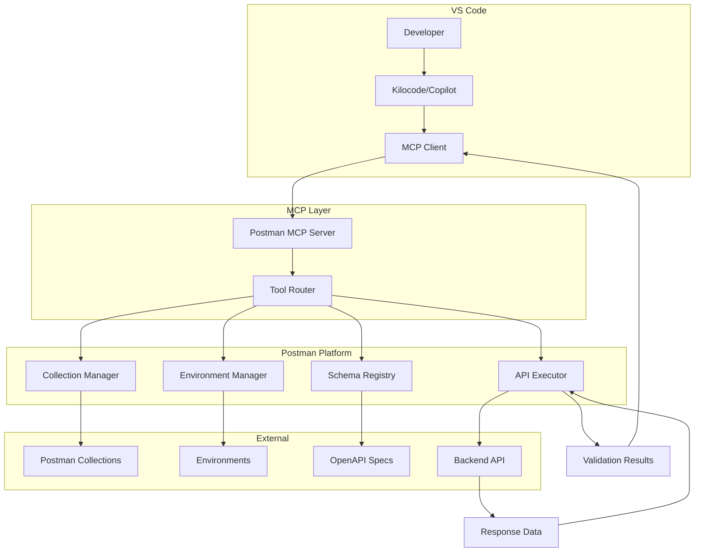
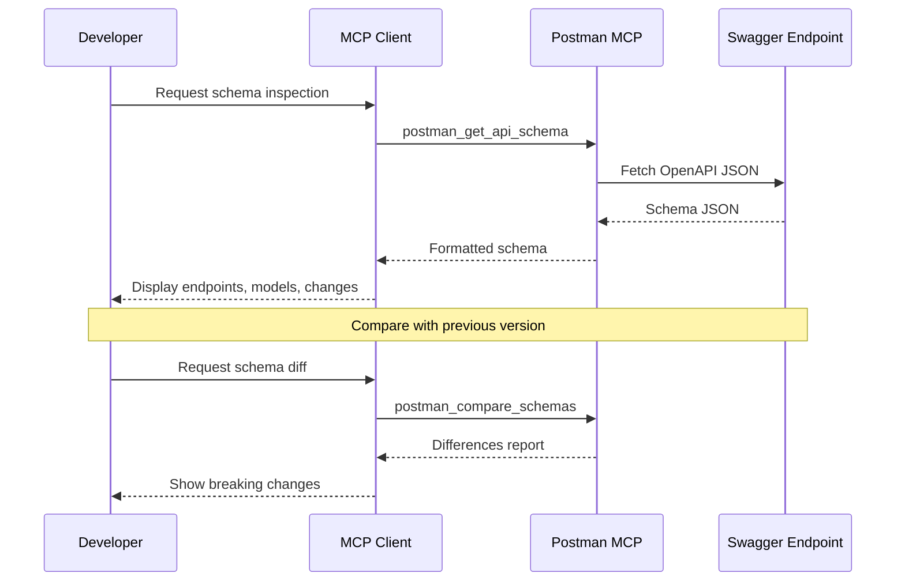
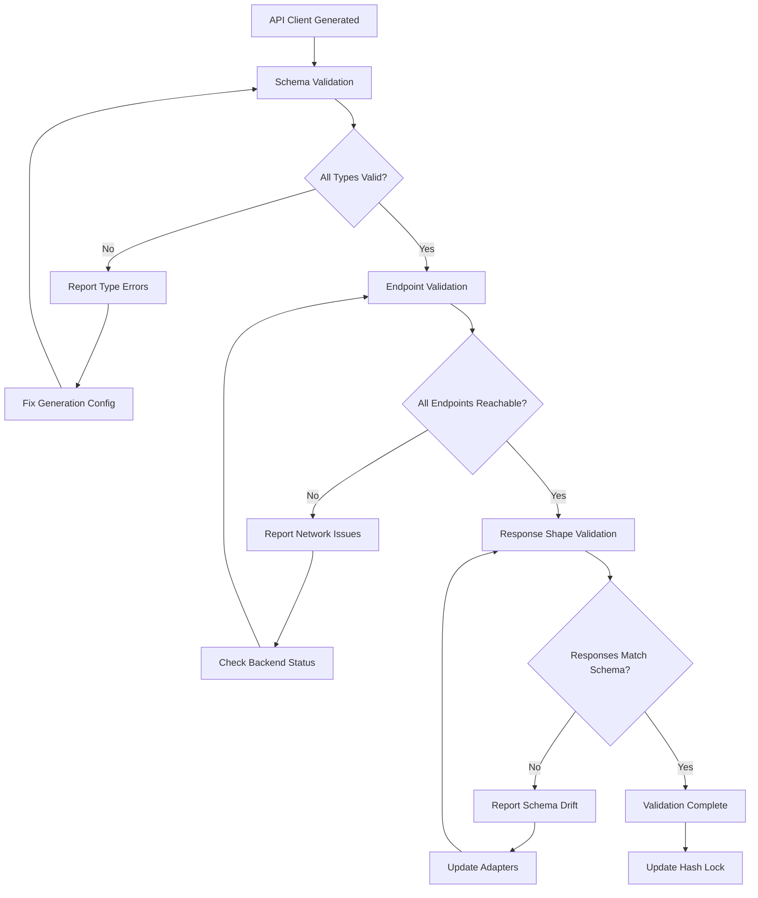
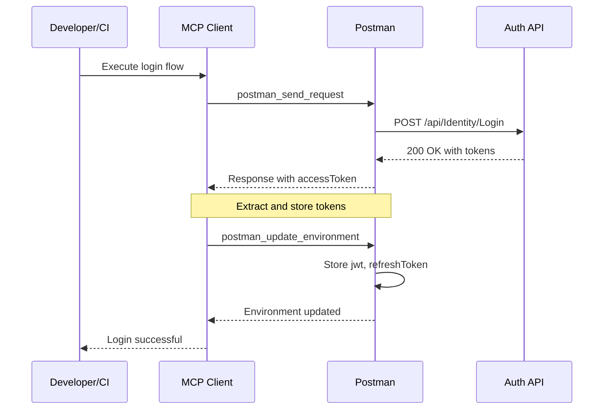
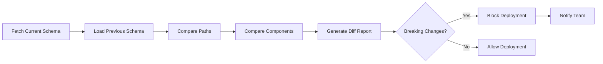
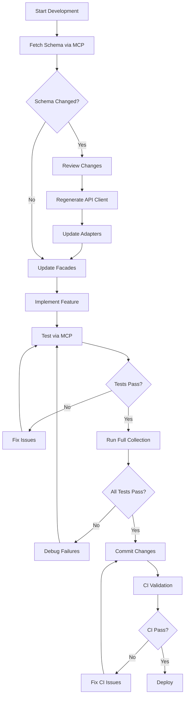

# Postman MCP Integration Workflow
## Maximum Automation Depth Implementation Guide

---

## Table of Contents

1. [Overview](#1-overview)
2. [MCP Server Configuration](#2-mcp-server-configuration)
3. [Available MCP Tools Reference](#3-available-mcp-tools-reference)
4. [Pre-Generation Workflow](#4-pre-generation-workflow)
5. [Post-Generation Validation Workflow](#5-post-generation-validation-workflow)
6. [Authentication Automation](#6-authentication-automation)
7. [Collection Test Execution](#7-collection-test-execution)
8. [Schema Comparison & Drift Detection](#8-schema-comparison--drift-detection)
9. [IDE Integration Procedures](#9-ide-integration-procedures)
10. [CI/CD Integration](#10-cicd-integration)
11. [Error Handling & Recovery](#11-error-handling--recovery)
12. [Complete Workflow Examples](#12-complete-workflow-examples)

---

## 1. Overview

### Purpose

Postman MCP (Model Context Protocol) provides direct integration between VS Code and Postman's API platform, enabling:

- **Schema Inspection** - Query OpenAPI schemas directly from IDE
- **Endpoint Validation** - Verify API responses match expected schemas
- **Payload Generation** - Auto-generate request payloads from schema
- **Collection Execution** - Run Postman collections from IDE
- **Environment Management** - Manage variables and tokens
- **Response Analysis** - Compare actual vs expected responses

### Architecture



---

## 2. MCP Server Configuration

### 2.1 Current Configuration

```json
// .vscode/mcp.json
{
  "servers": {
    "postman": {
      "type": "http",
      "url": "https://mcp.postman.com/mcp",
      "headers": {
        "x-api-key": "${POSTMAN_API_KEY}"
      }
    }
  }
}
```

### 2.2 Enhanced Configuration with Environment Variables

```json
// .vscode/mcp.json - Enhanced
{
  "servers": {
    "postman": {
      "type": "http",
      "url": "https://mcp.postman.com/mcp",
      "headers": {
        "x-api-key": "${POSTMAN_API_KEY}"
      },
      "env": {
        "POSTMAN_API_KEY": "${env:POSTMAN_API_KEY}"
      }
    }
  }
}
```

### 2.3 Environment Setup

```bash
# .env (add to .gitignore)
POSTMAN_API_KEY=PMAK-xxxxxxxxxxxxxxxxxxxxxxxxxxxxxxxx

# Or set in shell profile
export POSTMAN_API_KEY=PMAK-xxxxxxxxxxxxxxxxxxxxxxxxxxxxxxxx
```

### 2.4 Postman API Key Requirements

The API key needs the following permissions:
- **Collections** - Read, Write
- **Environments** - Read, Write
- **APIs** - Read
- **Mock Servers** - Read (optional)

---

## 3. Available MCP Tools Reference

### 3.1 Collection Management Tools

| Tool | Description | Parameters |
|------|-------------|------------|
| `postman_list_collections` | List all collections | `workspaceId` (optional) |
| `postman_get_collection` | Get collection details | `collectionId` |
| `postman_create_collection` | Create new collection | `name`, `schema` |
| `postman_update_collection` | Update collection | `collectionId`, `schema` |
| `postman_delete_collection` | Delete collection | `collectionId` |

### 3.2 Environment Management Tools

| Tool | Description | Parameters |
|------|-------------|------------|
| `postman_list_environments` | List all environments | `workspaceId` (optional) |
| `postman_get_environment` | Get environment details | `environmentId` |
| `postman_update_environment` | Update environment variables | `environmentId`, `values` |
| `postman_create_environment` | Create new environment | `name`, `values` |

### 3.3 API Execution Tools

| Tool | Description | Parameters |
|------|-------------|------------|
| `postman_send_request` | Execute HTTP request | `method`, `url`, `headers`, `body` |
| `postman_run_collection` | Run entire collection | `collectionId`, `environmentId` |
| `postman_run_single_request` | Run single request from collection | `collectionId`, `requestId` |

### 3.4 Schema Tools

| Tool | Description | Parameters |
|------|-------------|------------|
| `postman_get_api_schema` | Get OpenAPI schema | `apiId`, `versionId` |
| `postman_validate_schema` | Validate JSON against schema | `schema`, `data` |
| `postman_compare_schemas` | Compare two schemas | `schema1`, `schema2` |

### 3.5 Utility Tools

| Tool | Description | Parameters |
|------|-------------|------------|
| `postman_generate_example` | Generate example from schema | `schema` |
| `postman_extract_variables` | Extract variables from response | `response`, `variableDefs` |

---

## 4. Pre-Generation Workflow

### 4.1 Schema Inspection Before Regeneration

**Purpose:** Verify the current Swagger schema before regenerating API clients.

**Workflow:**



**MCP Tool Call Example:**

```json
{
  "tool": "postman_get_api_schema",
  "parameters": {
    "apiId": "ask-a-muslim-api",
    "versionId": "v1",
    "format": "openapi3"
  }
}
```

**Expected Response:**

```json
{
  "openapi": "3.0.1",
  "info": {
    "title": "AskAMuslim API",
    "version": "v1"
  },
  "paths": {
    "/api/Identity/Login": {
      "post": {
        "tags": ["Identity"],
        "requestBody": {
          "content": {
            "application/json": {
              "schema": {
                "$ref": "#/components/schemas/LoginViewModel"
              }
            }
          }
        },
        "responses": {
          "200": {
            "description": "Success",
            "content": {
              "application/json": {
                "schema": {
                  "$ref": "#/components/schemas/AuthResponse"
                }
              }
            }
          }
        }
      }
    }
  },
  "components": {
    "schemas": {
      "LoginViewModel": {
        "type": "object",
        "properties": {
          "email": { "type": "string" },
          "password": { "type": "string" }
        },
        "required": ["email", "password"]
      }
    }
  }
}
```

### 4.2 Endpoint Verification Checklist

Before regenerating, verify:

```markdown
## Pre-Generation Checklist

### New Endpoints
- [ ] Identify any new endpoints added since last generation
- [ ] Document new DTOs required
- [ ] Plan adapter implementations

### Modified Endpoints
- [ ] Identify changed request/response schemas
- [ ] Document breaking changes
- [ ] Plan migration path for existing code

### Deprecated Endpoints
- [ ] Identify removed endpoints
- [ ] Find usages in codebase
- [ ] Plan removal or migration

### Schema Changes
- [ ] New enum values
- [ ] Changed required fields
- [ ] New optional fields
- [ ] Type changes
```

### 4.3 Automated Pre-Generation Script

```typescript
// scripts/pre-generation-check.ts
import { execSync } from 'child_process';
import { writeFileSync, readFileSync, existsSync } from 'fs';

interface SchemaChange {
  type: 'added' | 'modified' | 'removed';
  endpoint: string;
  method: string;
  details: string;
}

async function preGenerationCheck(): Promise<SchemaChange[]> {
  const SWAGGER_URL = 'https://askamusslimapi.runasp.net/swagger/v1/swagger.json';
  const PREVIOUS_SCHEMA = 'schemas/previous-swagger.json';
  
  // Fetch current schema
  console.log('Fetching current Swagger schema...');
  const currentSchema = execSync(`curl -s ${SWAGGER_URL}`).toString();
  
  if (!existsSync(PREVIOUS_SCHEMA)) {
    console.log('No previous schema found. Saving current as baseline.');
    writeFileSync(PREVIOUS_SCHEMA, currentSchema);
    return [];
  }
  
  // Compare schemas
  const previousSchema = readFileSync(PREVIOUS_SCHEMA, 'utf-8');
  const changes = compareSchemas(JSON.parse(previousSchema), JSON.parse(currentSchema));
  
  // Report changes
  if (changes.length > 0) {
    console.log('\n=== Schema Changes Detected ===\n');
    changes.forEach(change => {
      console.log(`[${change.type.toUpperCase()}] ${change.method} ${change.endpoint}`);
      console.log(`  ${change.details}\n`);
    });
  } else {
    console.log('No schema changes detected.');
  }
  
  return changes;
}

function compareSchemas(previous: any, current: any): SchemaChange[] {
  const changes: SchemaChange[] = [];
  
  const prevPaths = Object.keys(previous.paths || {});
  const currPaths = Object.keys(current.paths || {});
  
  // Find new endpoints
  currPaths.forEach(path => {
    if (!prevPaths.includes(path)) {
      Object.keys(current.paths[path]).forEach(method => {
        changes.push({
          type: 'added',
          endpoint: path,
          method: method.toUpperCase(),
          details: 'New endpoint added'
        });
      });
    }
  });
  
  // Find removed endpoints
  prevPaths.forEach(path => {
    if (!currPaths.includes(path)) {
      Object.keys(previous.paths[path]).forEach(method => {
        changes.push({
          type: 'removed',
          endpoint: path,
          method: method.toUpperCase(),
          details: 'Endpoint removed'
        });
      });
    }
  });
  
  // Find modified endpoints
  currPaths.forEach(path => {
    if (prevPaths.includes(path)) {
      Object.keys(current.paths[path]).forEach(method => {
        const prevSchema = JSON.stringify(previous.paths[path][method]);
        const currSchema = JSON.stringify(current.paths[path][method]);
        if (prevSchema !== currSchema) {
          changes.push({
            type: 'modified',
            endpoint: path,
            method: method.toUpperCase(),
            details: 'Schema modified'
          });
        }
      });
    }
  });
  
  return changes;
}

preGenerationCheck();
```

---

## 5. Post-Generation Validation Workflow

### 5.1 Validation Pipeline



### 5.2 Response Shape Validation

**Purpose:** Verify that actual API responses match the generated TypeScript types.

**MCP Tool Call:**

```json
{
  "tool": "postman_send_request",
  "parameters": {
    "method": "GET",
    "url": "https://askamusslimapi.runasp.net/api/Course/GetCourses",
    "headers": {
      "Authorization": "Bearer {{jwt}}",
      "Accept": "application/json"
    }
  }
}
```

**Validation Script:**

```typescript
// scripts/validate-response-shapes.ts
import { execSync } from 'child_process';

interface ValidationRule {
  endpoint: string;
  method: 'GET' | 'POST' | 'PUT' | 'DELETE';
  expectedType: string;
  skipAuth: boolean;
}

const validationRules: ValidationRule[] = [
  { endpoint: '/api/Course/GetCourses', method: 'GET', expectedType: 'CourseReadDto[]', skipAuth: false },
  { endpoint: '/api/Identity/Users', method: 'GET', expectedType: 'UserDto[]', skipAuth: false },
  { endpoint: '/api/PrayerTimes', method: 'GET', expectedType: 'PrayerTimesDto', skipAuth: true },
];

async function validateResponseShapes(): Promise<void> {
  const baseUrl = 'https://askamusslimapi.runasp.net';
  const jwt = process.env.TEST_JWT_TOKEN;
  
  for (const rule of validationRules) {
    console.log(`Validating: ${rule.method} ${rule.endpoint}`);
    
    const headers: Record<string, string> = {
      'Accept': 'application/json'
    };
    
    if (!rule.skipAuth && jwt) {
      headers['Authorization'] = `Bearer ${jwt}`;
    }
    
    // Execute via MCP or curl
    const response = await executeRequest(rule.method, `${baseUrl}${rule.endpoint}`, headers);
    
    // Validate response shape
    const validation = validateAgainstType(response, rule.expectedType);
    
    if (!validation.valid) {
      console.error(`❌ Validation failed for ${rule.endpoint}:`);
      validation.errors.forEach(err => console.error(`   - ${err}`));
    } else {
      console.log(`✅ Validation passed for ${rule.endpoint}`);
    }
  }
}

function validateAgainstType(data: any, typeName: string): { valid: boolean; errors: string[] } {
  // Import generated type and validate
  // This would use TypeScript compiler API or runtime type checking
  return { valid: true, errors: [] };
}

async function executeRequest(method: string, url: string, headers: Record<string, string>): Promise<any> {
  // Implementation using MCP or direct HTTP
  return {};
}

validateResponseShapes();
```

### 5.3 Type Compilation Check

```bash
# After generation, verify TypeScript compilation
npm run generate:api && npx tsc --noEmit

# Check for type errors in generated code
npx tsc --noEmit 2>&1 | grep "src/app/core/api/generated"
```

---

## 6. Authentication Automation

### 6.1 Automated Login Flow

**Purpose:** Automatically authenticate and store JWT tokens in Postman environment.

**MCP Workflow:**



### 6.2 Login Request Configuration

```json
{
  "tool": "postman_send_request",
  "parameters": {
    "method": "POST",
    "url": "https://askamusslimapi.runasp.net/api/Identity/Login",
    "headers": {
      "Content-Type": "application/json"
    },
    "body": {
      "email": "{{testUserEmail}}",
      "password": "{{testUserPassword}}"
    }
  }
}
```

### 6.3 Postman Test Script for Login

```javascript
// Login Endpoint Test Script
// This runs automatically after the login request

if (pm.response.code === 200) {
  const body = pm.response.json();
  
  // Validate response structure
  pm.test("Response has required fields", () => {
    pm.expect(body).to.have.property("accessToken");
    pm.expect(body).to.have.property("refreshToken");
    pm.expect(body).to.have.property("expiresIn");
    pm.expect(body.accessToken).to.be.a("string");
    pm.expect(body.refreshToken).to.be.a("string");
    pm.expect(body.expiresIn).to.be.a("number");
  });
  
  // Store tokens in environment
  pm.environment.set("jwt", body.accessToken);
  pm.environment.set("refreshToken", body.refreshToken);
  pm.environment.set("tokenExpiry", Date.now() + (body.expiresIn * 1000));
  
  // Store user info if available
  if (body.user) {
    pm.environment.set("userId", body.user.id);
    pm.environment.set("userEmail", body.user.email);
    pm.environment.set("userName", body.user.name);
  }
  
  // Decode JWT for debugging (optional)
  try {
    const payload = JSON.parse(atob(body.accessToken.split('.')[1]));
    console.log("JWT Payload:", payload);
    pm.environment.set("jwtPayload", JSON.stringify(payload));
  } catch (e) {
    console.warn("Could not decode JWT:", e.message);
  }
  
  console.log("✅ Authentication successful - tokens stored");
}

// Handle error responses
if (pm.response.code === 401) {
  console.error("❌ Authentication failed - invalid credentials");
  pm.environment.set("jwt", "");
  pm.environment.set("refreshToken", "");
}

if (pm.response.code === 400) {
  const body = pm.response.json();
  console.error("❌ Bad request:", body.message || body);
}
```

### 6.4 Token Refresh Automation

```javascript
// Token Refresh Script
// Run this before any authenticated request

const tokenExpiry = pm.environment.get("tokenExpiry");
const refreshToken = pm.environment.get("refreshToken");

if (tokenExpiry && Date.now() > tokenExpiry - 60000) {
  // Token expires in less than 1 minute, refresh it
  console.log("Token expiring soon, refreshing...");
  
  pm.sendRequest({
    url: pm.environment.get("baseUrl") + "/api/Identity/Refresh",
    method: "POST",
    header: {
      "Content-Type": "application/json"
    },
    body: {
      mode: "raw",
      raw: JSON.stringify({
        refreshToken: refreshToken
      })
    }
  }, (err, res) => {
    if (!err && res.code === 200) {
      const body = res.json();
      pm.environment.set("jwt", body.accessToken);
      pm.environment.set("refreshToken", body.refreshToken);
      pm.environment.set("tokenExpiry", Date.now() + (body.expiresIn * 1000));
      console.log("✅ Token refreshed successfully");
    } else {
      console.error("❌ Token refresh failed:", err || res.json());
      // Clear tokens - user needs to re-authenticate
      pm.environment.set("jwt", "");
      pm.environment.set("refreshToken", "");
    }
  });
}
```

### 6.5 Collection Pre-request Script

```javascript
// Collection-level Pre-request Script
// Automatically attaches Authorization header to all requests

const jwt = pm.environment.get("jwt");
const skipAuth = pm.request.headers.has("X-Skip-Auth");

if (jwt && !skipAuth) {
  pm.request.headers.add({
    key: "Authorization",
    value: `Bearer ${jwt}`
  });
}

// Remove the skip header if present
if (skipAuth) {
  pm.request.headers.remove("X-Skip-Auth");
}
```

---

## 7. Collection Test Execution

### 7.1 Running Collections via MCP

**Single Request:**

```json
{
  "tool": "postman_run_single_request",
  "parameters": {
    "collectionId": "{{collectionId}}",
    "requestId": "{{loginRequestId}}",
    "environmentId": "{{devEnvironmentId}}"
  }
}
```

**Full Collection:**

```json
{
  "tool": "postman_run_collection",
  "parameters": {
    "collectionId": "{{collectionId}}",
    "environmentId": "{{devEnvironmentId}}",
    "options": {
      "timeout": 60000,
      "delayRequest": 100,
      "stopOnError": false
    }
  }
}
```

### 7.2 Collection Structure

```yaml
# AskAMuslim API Collection Structure
AskAMuslim API:
  ├── Authentication
  │   ├── Login (POST /api/Identity/Login)
  │   ├── Register (POST /api/Identity/Register)
  │   ├── Logout (POST /api/Identity/Logout)
  │   └── Refresh Token (POST /api/Identity/Refresh)
  │
  ├── Courses
  │   ├── Get All Courses (GET /api/Course)
  │   ├── Get Course by ID (GET /api/Course/{id})
  │   ├── Create Course (POST /api/Course)
  │   ├── Update Course (PUT /api/Course/{id})
  │   └── Delete Course (DELETE /api/Course/{id})
  │
  ├── Enrollments
  │   ├── Get Enrollments (GET /api/Enrollment)
  │   ├── Enroll in Course (POST /api/Enrollment)
  │   └── Unenroll (DELETE /api/Enrollment/{id})
  │
  ├── Prayer Times
  │   ├── Get Prayer Times (GET /api/PrayerTimes)
  │   └── Get by Location (GET /api/PrayerTimes/Location)
  │
  └── Qibla
      └── Get Qibla Direction (GET /api/Qibla)
```

### 7.3 Test Script Templates

**CRUD Operations Test:**

```javascript
// Generic CRUD Test Script
const expectedStatus = {
  GET: 200,
  POST: 201,
  PUT: 200,
  DELETE: 204
};

pm.test(`Status code is ${expectedStatus[pm.request.method]}`, () => {
  pm.response.to.have.status(expectedStatus[pm.request.method]);
});

pm.test("Response time is acceptable", () => {
  pm.expect(pm.response.responseTime).to.be.below(2000);
});

pm.test("Response has correct content type", () => {
  pm.expect(pm.response.headers.get("Content-Type")).to.include("application/json");
});

// For GET requests, validate array or object response
if (pm.request.method === "GET") {
  const body = pm.response.json();
  
  if (Array.isArray(body)) {
    pm.test("Response is array with items", () => {
      pm.expect(body).to.be.an("array");
      if (body.length > 0) {
        pm.expect(body[0]).to.be.an("object");
      }
    });
  } else {
    pm.test("Response is object", () => {
      pm.expect(body).to.be.an("object");
    });
  }
}
```

**Authentication Required Test:**

```javascript
// Test that endpoint requires authentication
pm.test("Endpoint requires authentication", () => {
  // This test should run without auth header
  pm.response.to.have.status(401);
});

pm.test("Error message is correct", () => {
  const body = pm.response.json();
  pm.expect(body.message || body.title).to.include("unauthorized");
});
```

---

## 8. Schema Comparison & Drift Detection

### 8.1 Schema Comparison Workflow



### 8.2 MCP Schema Comparison

```json
{
  "tool": "postman_compare_schemas",
  "parameters": {
    "schema1": {
      "source": "url",
      "url": "https://askamusslimapi.runasp.net/swagger/v1/swagger.json"
    },
    "schema2": {
      "source": "file",
      "path": "schemas/previous-swagger.json"
    },
    "options": {
      "checkBreakingChanges": true,
      "includeDescriptions": false
    }
  }
}
```

### 8.3 Breaking Change Detection

```typescript
// scripts/detect-breaking-changes.ts
interface BreakingChange {
  type: 'endpoint_removed' | 'required_field_added' | 'type_changed' | 'enum_value_removed';
  location: string;
  description: string;
  severity: 'critical' | 'warning';
}

function detectBreakingChanges(oldSchema: any, newSchema: any): BreakingChange[] {
  const changes: BreakingChange[] = [];
  
  // Check for removed endpoints
  const oldPaths = Object.keys(oldSchema.paths || {});
  const newPaths = Object.keys(newSchema.paths || {});
  
  oldPaths.forEach(path => {
    if (!newPaths.includes(path)) {
      changes.push({
        type: 'endpoint_removed',
        location: path,
        description: `Endpoint ${path} was removed from the API`,
        severity: 'critical'
      });
    }
  });
  
  // Check for required field additions
  const oldSchemas = oldSchema.components?.schemas || {};
  const newSchemas = newSchema.components?.schemas || {};
  
  Object.keys(newSchemas).forEach(schemaName => {
    if (oldSchemas[schemaName]) {
      const oldRequired = oldSchemas[schemaName].required || [];
      const newRequired = newSchemas[schemaName].required || [];
      
      newRequired.forEach((field: string) => {
        if (!oldRequired.includes(field)) {
          changes.push({
            type: 'required_field_added',
            location: `${schemaName}.${field}`,
            description: `Field ${field} is now required in ${schemaName}`,
            severity: 'warning'
          });
        }
      });
    }
  });
  
  return changes;
}
```

### 8.4 Schema Drift Report

```markdown
# Schema Drift Report
Generated: 2026-02-11T22:00:00Z

## Summary
- **Endpoints Added:** 2
- **Endpoints Modified:** 3
- **Endpoints Removed:** 0
- **Breaking Changes:** 0

## Details

### Added Endpoints
| Method | Path | Description |
|--------|------|-------------|
| GET | /api/Course/ByCategory/{categoryName} | Get courses by category |
| POST | /api/Certificate/AutoGenerate | Auto-generate certificate |

### Modified Endpoints
| Method | Path | Change |
|--------|------|--------|
| POST | /api/Identity/Login | Added `rememberMe` optional field |
| GET | /api/Course/{id} | Added `instructorName` to response |
| PUT | /api/Enrollment/{id} | Changed `status` enum values |

### Schema Changes
| Schema | Field | Old Type | New Type |
|--------|-------|----------|----------|
| CourseReadDto | instructorName | - | string (added) |
| LoginViewModel | rememberMe | - | boolean (added) |

## Recommendations
1. Regenerate API client: `npm run generate:api`
2. Update CourseAdapter to handle new `instructorName` field
3. Update login form to include `rememberMe` checkbox
```

---

## 9. IDE Integration Procedures

### 9.1 VS Code Integration

**Command Palette Commands:**

```
Postman: Run Collection          - Run entire Postman collection
Postman: Send Request            - Send current request
Postman: Validate Schema         - Validate response against schema
Postman: Refresh Token           - Manually refresh auth token
Postman: View Environment        - View current environment variables
Postman: Compare Schemas         - Compare two API schemas
```

### 9.2 Kilocode/Copilot Integration

**Prompt Templates for MCP Operations:**

```
# Schema Inspection
"Use Postman MCP to fetch the OpenAPI schema for the AskAMuslim API and list all endpoints related to courses."

# Endpoint Validation
"Use Postman MCP to send a GET request to /api/Course and validate the response matches the CourseReadDto schema."

# Token Management
"Use Postman MCP to execute the login endpoint with test credentials and store the JWT in the environment."

# Collection Execution
"Use Postman MCP to run the full AskAMuslim collection against the dev environment and report any failures."
```

### 9.3 Keyboard Shortcuts

```json
// keybindings.json
[
  {
    "key": "ctrl+shift+p m",
    "command": "postman.runCollection"
  },
  {
    "key": "ctrl+shift+p r",
    "command": "postman.sendRequest"
  },
  {
    "key": "ctrl+shift+p v",
    "command": "postman.validateSchema"
  }
]
```

---

## 10. CI/CD Integration

### 10.1 Newman CLI Integration

```yaml
# .github/workflows/api-validation.yml
name: API Validation

on:
  push:
    branches: [main, dev]
  pull_request:
    branches: [main, dev]

jobs:
  postman-tests:
    runs-on: ubuntu-latest
    steps:
      - uses: actions/checkout@v4
      
      - name: Install Newman
        run: npm install -g newman newman-reporter-htmlextra
      
      - name: Run Postman Collection
        run: |
          newman run postman_collection.json \
            --environment postman_environment.json \
            --globals postman_globals.json \
            --reporters cli,htmlextra,json \
            --reporter-htmlextra-export newman-report.html \
            --reporter-json-export newman-report.json \
            --timeout 60000 \
            --delay-request 100
        env:
          TEST_USER_EMAIL: ${{ secrets.TEST_USER_EMAIL }}
          TEST_USER_PASSWORD: ${{ secrets.TEST_USER_PASSWORD }}
      
      - name: Upload Newman Reports
        uses: actions/upload-artifact@v4
        if: always()
        with:
          name: newman-reports
          path: |
            newman-report.html
            newman-report.json
      
      - name: Check Newman Results
        run: |
          if grep -q '"failures":\[[^]]\+\]' newman-report.json; then
            echo "❌ Postman tests failed"
            exit 1
          fi
          echo "✅ All Postman tests passed"
```

### 10.2 MCP in CI Environment

```yaml
# .github/workflows/mcp-validation.yml
name: MCP API Validation

on:
  workflow_dispatch:
  schedule:
    - cron: '0 6 * * *'  # Daily at 6 AM UTC

jobs:
  mcp-validation:
    runs-on: ubuntu-latest
    steps:
      - uses: actions/checkout@v4
      
      - name: Setup Node
        uses: actions/setup-node@v4
        with:
          node-version: '20'
      
      - name: Install Dependencies
        run: npm ci
      
      - name: Run MCP Validation Script
        run: npx ts-node scripts/mcp-validation.ts
        env:
          POSTMAN_API_KEY: ${{ secrets.POSTMAN_API_KEY }}
          COLLECTION_ID: ${{ secrets.POSTMAN_COLLECTION_ID }}
          ENVIRONMENT_ID: ${{ secrets.POSTMAN_ENVIRONMENT_ID }}
```

### 10.3 MCP Validation Script

```typescript
// scripts/mcp-validation.ts
import { execSync } from 'child_process';

interface MCPConfig {
  apiKey: string;
  collectionId: string;
  environmentId: string;
}

async function runMCPValidation(config: MCPConfig): Promise<void> {
  console.log('Starting MCP-based API validation...\n');
  
  // 1. Fetch current schema
  console.log('1. Fetching current OpenAPI schema...');
  const schema = await fetchSchema(config);
  
  // 2. Compare with stored schema
  console.log('2. Comparing with stored schema...');
  const changes = await compareSchemas(schema);
  
  if (changes.breaking.length > 0) {
    console.error('❌ Breaking changes detected:');
    changes.breaking.forEach(c => console.error(`   - ${c}`));
    process.exit(1);
  }
  
  // 3. Run collection tests
  console.log('3. Running Postman collection...');
  const results = await runCollection(config);
  
  if (results.failed > 0) {
    console.error(`❌ ${results.failed} tests failed`);
    process.exit(1);
  }
  
  console.log(`✅ All ${results.passed} tests passed`);
  
  // 4. Validate response shapes
  console.log('4. Validating response shapes...');
  await validateResponses(config);
  
  console.log('\n✅ MCP validation complete');
}

async function fetchSchema(config: MCPConfig): Promise<any> {
  // Implementation using MCP HTTP endpoint
  return {};
}

async function compareSchemas(schema: any): Promise<{ breaking: string[] }> {
  return { breaking: [] };
}

async function runCollection(config: MCPConfig): Promise<{ passed: number; failed: number }> {
  return { passed: 0, failed: 0 };
}

async function validateResponses(config: MCPConfig): Promise<void> {
  // Implementation
}

const config: MCPConfig = {
  apiKey: process.env.POSTMAN_API_KEY!,
  collectionId: process.env.COLLECTION_ID!,
  environmentId: process.env.ENVIRONMENT_ID!
};

runMCPValidation(config);
```

---

## 11. Error Handling & Recovery

### 11.1 Common MCP Errors

| Error | Cause | Recovery |
|-------|-------|----------|
| `401 Unauthorized` | Invalid/expired API key | Regenerate Postman API key |
| `404 Collection not found` | Wrong collection ID | Verify collection ID in Postman |
| `429 Rate limited` | Too many requests | Implement retry with backoff |
| `500 Server error` | Postman service issue | Retry after delay |
| `ETIMEDOUT` | Network timeout | Increase timeout, check network |

### 11.2 Error Recovery Script

```typescript
// scripts/mcp-error-recovery.ts
import { setTimeout as sleep } from 'timers/promises';

interface RetryConfig {
  maxRetries: number;
  baseDelay: number;
  maxDelay: number;
}

async function withRetry<T>(
  operation: () => Promise<T>,
  config: RetryConfig = { maxRetries: 3, baseDelay: 1000, maxDelay: 10000 }
): Promise<T> {
  let lastError: Error | null = null;
  
  for (let attempt = 0; attempt < config.maxRetries; attempt++) {
    try {
      return await operation();
    } catch (error: any) {
      lastError = error;
      
      if (error.status === 401) {
        throw new Error('Authentication failed - check API key');
      }
      
      if (error.status === 429) {
        const delay = Math.min(config.baseDelay * Math.pow(2, attempt), config.maxDelay);
        console.log(`Rate limited, waiting ${delay}ms before retry...`);
        await sleep(delay);
        continue;
      }
      
      if (attempt < config.maxRetries - 1) {
        const delay = config.baseDelay * (attempt + 1);
        console.log(`Attempt ${attempt + 1} failed, retrying in ${delay}ms...`);
        await sleep(delay);
      }
    }
  }
  
  throw lastError;
}
```

### 11.3 Fallback Procedures

```markdown
## MCP Fallback Procedures

### If MCP is unavailable:
1. Use Newman CLI directly for collection runs
2. Use curl for individual endpoint testing
3. Use Swagger UI for manual API exploration
4. Use Postman desktop app for debugging

### If Postman API is down:
1. Check https://status.postman.com/
2. Use cached schema from previous run
3. Delay validation until service restored
4. Notify team of validation delay

### If authentication fails:
1. Verify API key hasn't expired
2. Check API key permissions
3. Regenerate API key if needed
4. Update .env and MCP configuration
```

---

## 12. Complete Workflow Examples

### 12.1 Full Development Cycle



### 12.2 Example: Adding New Endpoint

```typescript
// Step 1: Check if endpoint exists in schema
// MCP Tool: postman_get_api_schema
const schema = await mcp.getApiSchema();
const hasEndpoint = schema.paths['/api/NewEndpoint'];

if (!hasEndpoint) {
  console.log('Endpoint not in schema. Backend needs to expose it first.');
  return;
}

// Step 2: Regenerate API client
// Command: npm run generate:api
execSync('npm run generate:api');

// Step 3: Create adapter
// File: src/app/core/api/adapters/new-endpoint.adapter.ts
// (Implementation based on generated DTO)

// Step 4: Create facade
// File: src/app/core/api/facades/new-endpoint.facade.ts
// (Implementation using adapter and generated functions)

// Step 5: Test via MCP
// MCP Tool: postman_send_request
const response = await mcp.sendRequest({
  method: 'GET',
  url: 'https://askamusslimapi.runasp.net/api/NewEndpoint',
  headers: { 'Authorization': `Bearer ${jwt}` }
});

// Step 6: Validate response
// MCP Tool: postman_validate_schema
const validation = await mcp.validateSchema({
  schema: schema.paths['/api/NewEndpoint'].get.responses['200'],
  data: response
});

if (!validation.valid) {
  console.error('Response does not match schema:', validation.errors);
}
```

### 12.3 Example: Debugging Failed Request

```typescript
// Step 1: Get request details from collection
// MCP Tool: postman_get_collection
const collection = await mcp.getCollection({ collectionId: 'xxx' });
const failedRequest = collection.item.find(r => r.name === 'Get Courses');

// Step 2: Execute request with detailed logging
// MCP Tool: postman_send_request
const response = await mcp.sendRequest({
  method: failedRequest.request.method,
  url: failedRequest.request.url.raw,
  headers: failedRequest.request.header,
  body: failedRequest.request.body
});

console.log('Request:', {
  method: failedRequest.request.method,
  url: failedRequest.request.url.raw,
  headers: failedRequest.request.header
});

console.log('Response:', {
  status: response.status,
  headers: response.headers,
  body: response.data
});

// Step 3: Compare with expected schema
// MCP Tool: postman_validate_schema
const validation = await mcp.validateSchema({
  schema: expectedSchema,
  data: response.data
});

// Step 4: Identify mismatch
if (!validation.valid) {
  console.log('Schema validation errors:');
  validation.errors.forEach(err => {
    console.log(`  - ${err.path}: ${err.message}`);
    console.log(`    Expected: ${err.expected}`);
    console.log(`    Actual: ${err.actual}`);
  });
}
```

---

## Appendix: MCP Tool Quick Reference Card

### Authentication
```
postman_send_request → Execute login → Store tokens in environment
postman_update_environment → Update jwt, refreshToken variables
```

### Schema Operations
```
postman_get_api_schema → Fetch current OpenAPI spec
postman_validate_schema → Validate response against schema
postman_compare_schemas → Detect breaking changes
```

### Collection Operations
```
postman_list_collections → List all collections
postman_get_collection → Get collection details
postman_run_collection → Execute all requests
postman_run_single_request → Execute specific request
```

### Environment Operations
```
postman_list_environments → List all environments
postman_get_environment → Get environment variables
postman_update_environment → Update variables
```

---

*Document Version: 1.0*
*Last Updated: 2026-02-11*
*Related: [Enterprise API Integration Architecture](enterprise-api-integration-architecture.md)*
